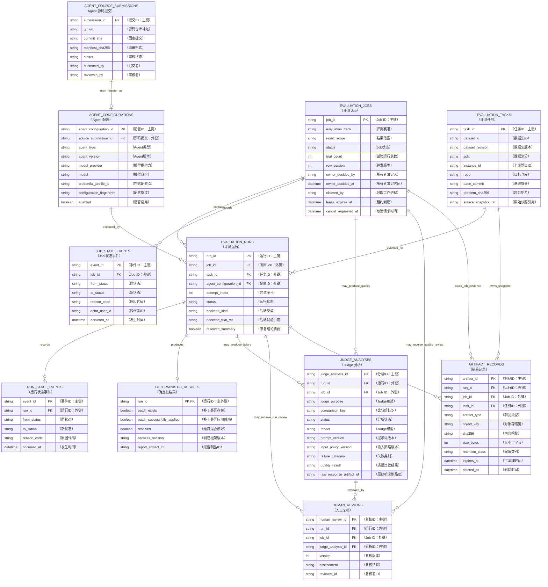
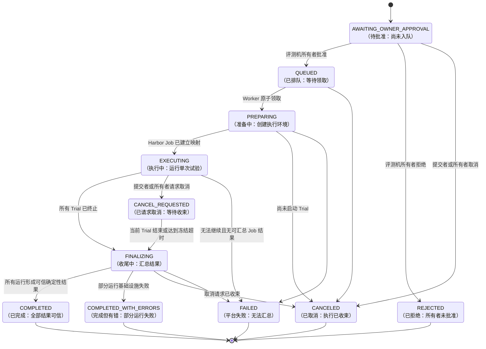
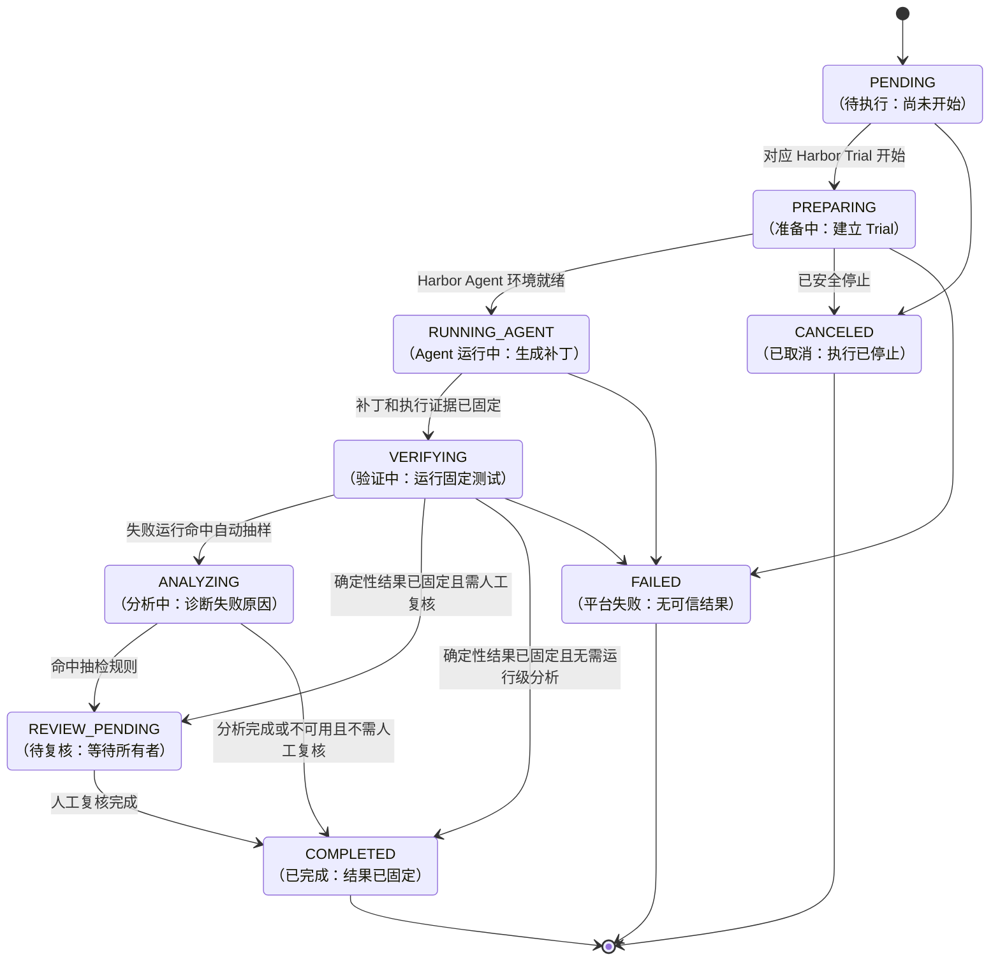
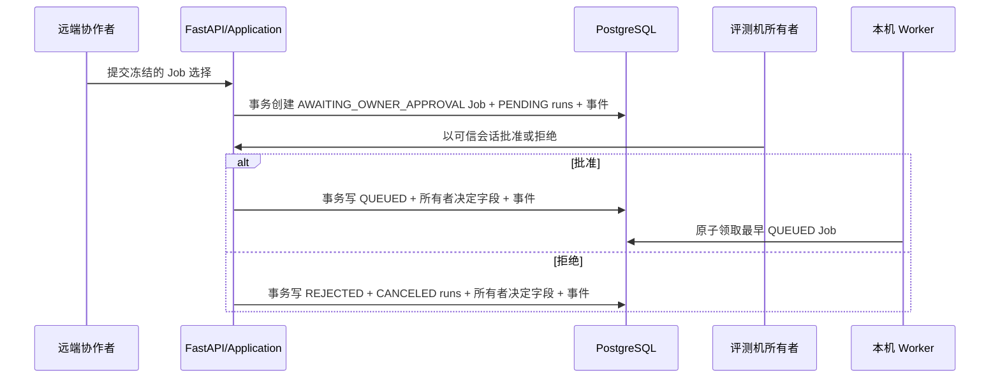
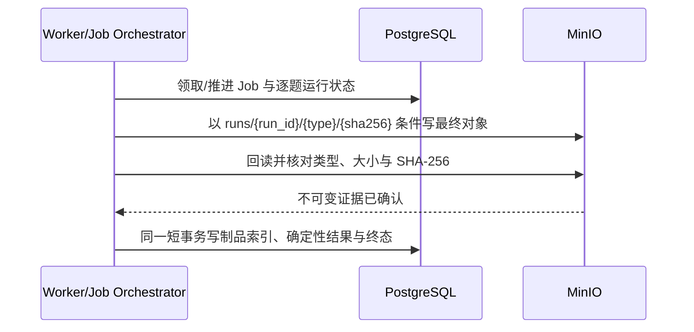

# 数据模型与制品布局

> 文档状态：Job/Run 架构已确认；字段契约 v0.3。长期 PostgreSQL 已部署；`evaluation_jobs.batch_preset` 已支持 `continuous`
>
> 最后更新：2026-09-20（同步 continuous 约束、显式旧库升级入口与长期库验证）
> 权威范围：本文件维护 PostgreSQL 实体、运行状态持久化、队列领取规则和 MinIO 对象布局。领域词义见 [`CONTEXT.md`](../../CONTEXT.md)，模块输入输出见 [`MODULE_CONTRACTS.md`](./MODULE_CONTRACTS.md)。

## 扩展规划与现有 schema 的分界

用户已确认[UI/题库/API扩展规格](../../.scratch/ui-catalog-providers/spec.md)。其中 continuous 预设与比较报告后端已先行落地；任务 03 Web 页面、五道新题和其他 04–08 范围仍未因此完成。后文任务03/04字段与约束描述当前代码；“P2才有DeepSeek/Kimi”的旧排期不覆盖本次新增的 Codex API 路径。

规划深化现有表，不新增表：新合格题继续进入 `tasks`；两家 Codex 配置继续进入 `agent_configurations`；Job/Run 快照继续承载冻结的任务/配置/策略。continuous 只扩展既有 `batch_preset` CHECK，不新增列或表；其他提供方变化仍须成套扩展、在全新/旧版隔离 PG 分别验证后显式升级。HTTP 启动不自动迁移用户库。

兼容要求：连续规模使用新增预设 `continuous`（1–20），旧 `demo/quick/standard` 区间、旧 Job 快照和请求摘要不改写。旧库通过 `agentexam-jobs upgrade-continuous-preset` 显式、幂等升级；实现只接受已知旧三值约束或已完成的四值约束，未知定义失败关闭。新增配置摘要覆盖关键提供方配置/模型目录/限制版本，旧 Agent 指纹保持旧算法验证。秘密和宿主路径不入表/JSON 快照；credential profile 仍为非秘密逻辑引用。API 计量状态不得因崩溃重置满额，其候选本机账本不成为第二 Job 队列。

报告继续保留 null：无可信美元金额不填写 `cost_usd`，人民币预算不是美元实际费用；新增限制版本影响可比性时沿既有分组校验，不混改历史排行。每个切片实现后在本文同步实际字段及证据。

## 1. 给初学者的解释

系统产生两种数据：

- PostgreSQL 像“目录和登记簿”：保存能查询、筛选、关联的短数据，例如某次运行是谁、什么状态、是否通过。
- MinIO 像“证据文件柜”：保存补丁、长日志、JSONL 轨迹和 Judge 原始响应等文件。

数据库只保存文件柜中的“档案号、大小和校验和”，不把所有大文件塞进表里。

## 2. 数据边界

当前实施范围见[总架构第 3.1 节](./ARCHITECTURE.md#31-m1-交付边界2026-09-09-已确认)。本文件的实体图和状态图保留完整目标设计；`judge_analyses`、`human_reviews` 及专用分析/复核状态属于后续阶段，M1 不建这两张表、不预写空分析记录。Owner Approval 已按任务 05 落地；任务 06 已落地单 Run 的领取/租约、执行状态、制品索引、`deterministic_results` 与报告恢复。

| 数据 | PostgreSQL | MinIO | 原因 |
|---|---:|---:|---|
| 任务身份、仓库、固定提交、Issue 标准字段 | ✅ | ✅ 内容哈希固定的原始任务 JSON | 数据库负责查询，原始快照负责复现和审计 |
| gold patch、`test_patch`、隐藏测试 | 仅受限验证引用 | 可选受限制品 | 不得通过普通 API/Runner 泄漏 |
| Agent 配置身份、版本、模型、配置指纹 | ✅ | 可选配置快照 | 排行榜与复现需要 |
| P2 Agent 源码提交与审核状态 | P2 | P2 可选审核附件 | MVP 不建表/接口；未来审核前仍不得进入执行链路 |
| Job/运行状态、所有者批准/拒绝、时间、限制、Worker 租约 | ✅ | ❌ | Job 需要先审计所有者决定再事务领取，运行需要逐题追溯 |
| 最终 patch | 元数据/摘要 | ✅ | 文件证据，不可覆盖 |
| 原始 stdout/stderr、轨迹 JSONL | 索引/汇总 | ✅ | 体积大、适合流式读写 |
| Harness 报告摘要 | ✅ | ✅ 原始报告/测试输出 | 查询与原始证据都需要 |
| Judge 用途、状态及失败/质量摘要 | ✅ | ✅ 清洗后请求/原始响应 | 保留触发、模型和输入策略证据；不保存秘密 |
| 人工复核结论 | ✅ | 可选附件 | 需要版本化和审计 |

## 3. 实体关系

图中保留数据库英文实体名与字段名，括号内为中文名称和最短必要解释；完整约束仍以第 4 节表级契约为准。



## 4. 表级契约

字段是候选 v0.3 的最小集合；实现迁移文件前仍要确定数据库类型、索引名和长度限制。

应用身份已经收窄为 `collaborator` 与唯一 `owner`。所有 `created_by`、`actor_user_id`、`reviewer_id`、清理者和所有者决定字段都必须引用可信登录身份，不能由请求正文自报；所有者在评测机本地建立/恢复并邀请协作者。2026-09-11 用户先确认两张身份表，随后批准任务 02 新增邀请表；不预建后续评测业务表。

### 4.0 身份表：`accounts` 与 `sessions`

任务 01 的实际结构在[身份 SQL](../../apps/backend/src/eval_platform/adapters/persistence/identity.sql)；只允许本机显式 `init-db` 在空白专属数据库运行，HTTP 启动不自动建表或迁移。

| 表/字段 | 类型与约束 | 作用 |
|---|---|---|
| `accounts.user_id` | UUID 主键 | 不变应用身份；恢复不换 ID |
| `accounts.username` | varchar(64)，唯一，3–64 位小写字母/数字/`_.-`，首位字母或数字 | 登录名，与页面契约一致 |
| `accounts.role` | owner / collaborator；owner 部分唯一索引 | 数据库约束最多一个 owner，不靠“先查后写”防并发 |
| `accounts.password_hash` | text，非空 | Argon2id 编码值，不能存密码明文 |
| `accounts.auth_version` | bigint > 0，默认 1 | 恢复或成员停用时递增，防止旧认证继续签发有效会话 |
| `accounts.active` / `created_at` | boolean / timestamptz | 活跃标记与 UTC 创建时间；任务 02 停用保留账号历史 |
| `sessions.token_hash` | 64 位十六进制摘要主键 | 只保存随机会话 token 的 SHA-256，不保存原 token |
| `sessions.user_id` | UUID 外键 → accounts | 会话所属身份，非秘密关联 |
| `sessions.auth_version` | bigint > 0 | 签发时账号版本，查询时必须仍匹配 |
| `sessions.expires_at` / `created_at` | timestamptz | 过期与创建时间；另有 user_id、expires_at 索引 |

会话查询同时检查未过期、账号 active 和版本匹配。签发会话先短事务锁账号并核对版本；恢复通过同一行锁原子更新密码/版本并删除此账号全部会话。于是恢复前读取的旧密码校验即使随后才完成，也不能在恢复后签发仍有效的旧版本会话。退出只删除对应会话，重复退出幂等。

账号/会话仅在 PostgreSQL；不放入 MinIO，不复用 Codex auth.json。密码库参数和依赖只在[依赖总表](../dependencies/DEPENDENCIES.md#22-m1-身份切片的依赖与本机入口)维护。邀请、会话到期数据的长期维护及其后续细化不在本任务预建后台服务。

结构与 Adapter 已有专属真实 PostgreSQL 集成证据，覆盖范围见[身份行动](../actions/2026-09-11-m1-owner-identity.md)；后续[评审修复](../actions/2026-09-11-m1-identity-review-fixes.md)未改变 SQL 或存储 Adapter，也未重跑数据库实验。不得以 SQL 文件存在或内存测试通过替代真实事务验证。上方 ER 图仍是评测业务目标图，这两张身份表构成任务 01 的先行身份子集。

#### 4.0.1 邀请表：`invitations`

任务 02 实际结构见[邀请 SQL](../../apps/backend/src/eval_platform/adapters/persistence/membership.sql)。accounts 只描述已有身份，sessions 只描述登录会话，不能承载尚未加入的邀请及独立到期/兑换状态，因此用户批准新增此表；不新建角色/权限表。

| 字段 | 类型与约束 | 作用 |
|---|---|---|
| `invitation_id` | UUID 主键 | 公开的邀请记录身份，不是兑换凭据 |
| `token_hash` | char(64)，唯一、十六进制约束 | 32 随机字节邀请码的 SHA-256；不存明文 |
| `created_by` | UUID → accounts | 创建者；Adapter 插入仅接受活跃 owner |
| `created_at/expires_at` | timestamptz 非空；后者大于前者 | 应用固定 24 小时有效期 |
| `revoked_at` | 可空 timestamptz | 撤销事实；不能同时有 redeemed_at |
| `redeemed_at/redeemed_by` | 可空 timestamptz / 唯一 UUID → accounts | 同时为空或同时存在；一份邀请对应一个新成员 |

`status` 不入库，由兑换/撤销/到期事实生成安全视图。兑换在短事务锁定邀请后复核到期（包括等锁消耗的时间），插入 collaborator 并标记兑换；冲突/任一写失败整体回滚。撤销使用同一邀请行锁，兑换与撤销只能有一个结果。成员停用锁定账号，确认非 owner 后原子写 `active=false`、增加版本并删除全部会话；与签发会话共用账号锁。重复停用不再增加版本，不删除身份记录。

新空库 `init-db` 在一个事务建立身份和邀请结构；已有任务 01 库只能显式执行 `upgrade-members` 补表，重复执行失败关闭，不重置数据；HTTP 启动不迁移。命令入口仅在[依赖总表](../dependencies/DEPENDENCIES.md#22-m1-身份切片的依赖与本机入口)维护。账号/会话/邀请均不进入 MinIO。

上方 ER 图仍为评测业务目标图；身份子集关系是 accounts 一对多 sessions、owner 一对多 invitations、每份已兑换邀请一对一新 collaborator。任务 02 真实 PG 并发/回滚/显式升级已实际验证，不是沿用任务 01 的旧证据，也不代表已部署长期数据库，实际记录见[成员行动](../actions/2026-09-11-m1-collaborator-invitations.md)。

### 4.1 `evaluation_tasks`

任务 03 已落地[目录 SQL](../../apps/backend/src/eval_platform/adapters/persistence/catalog/schema.sql)和 PostgreSQL Adapter，已通过本任务的隔离真实存储验证；只显式建立下列三表，不创建 Job/Run/P2 表。身份初始化行为不变，目录升级另用本机命令，HTTP 启动不建表；重复升级失败且整笔回滚。

实际最小类型：task_id/source_snapshot_ref 为 UUID；dataset_id/instance_id/repo 为 varchar(128)，revision/split 为 varchar(64)；base_commit 为小写 40 位摘要；problem_statement/environment_image 为非空 text；problem_sha256 与 raw_record_sha256 为小写 char(64)；created_at 为 timestamptz。任务身份四元组唯一，problem_sha256 对公开问题原文取 SHA-256，raw_record_sha256 对完整原始 JSON 字节取 SHA-256，两者含义不同。

source_snapshot_ref 通过 `(task_id, source_snapshot_ref, raw_record_sha256)` 组合外键指向同一任务的制品 ID 和 SHA-256；外键延迟到提交时校验，让标准字段与索引在同一短事务插入，不能提交只有任务没有对应索引的记录。对象 I/O 在事务外，先验证对象再发布。当前不另存 validation_ref：本任务原始快照是受限来源，尚未接 M1 Evaluator 的验证引用装配，不把 M0 路径或隐藏测试写入公开字段。任务数据集/split/repo/ID 有复合查询索引，当前精确筛选/分页已实测；EXPLAIN 查询计划优化尚未做，不声称性能已优化。

用途：登记可评测的固定 SWE-Gym 任务身份。

| 字段 | 约束/含义 |
|---|---|
| `task_id` | 主键；由数据集 ID、固定 revision、split、instance 生成或映射为不透明 ID |
| `dataset_id` | 例如已登记的 SWE-Gym Hugging Face 数据集 ID |
| `dataset_revision` | 固定 revision/校验值；禁止用会漂移的 `latest` 进入正式运行 |
| `split` | 上游真实 split |
| `instance_id` | 上游任务 ID；与 dataset/revision/split 组成唯一约束 |
| `repo` / `base_commit` | 仓库和固定代码基线 |
| `problem_statement` | 供页面查询和 Agent 输入的标准 Issue 原文 |
| `problem_sha256` | 对公开问题原文 UTF-8 字节取 SHA-256；数据库读出时重算比对，不一致即安全失败，不返回漂移的正文 |
| `source_snapshot_ref` | 必需的 MinIO 原始任务 JSON 引用，包含对象键、SHA-256、大小和数据集来源；与标准字段在同一同步动作中固定 |
| `validation_ref` | 只供 Evaluator 解析上游测试字段的受限引用；普通 API 不返回 |
| `created_at` | 登记时间 |

不直接允许 Web 修改任务内容；任务同步是项目组的受控维护动作。原始 JSON 可以包含仅供 Evaluator 的上游字段，但普通 API 和 Agent 可见视图只能读取允许字段，不能返回隐藏测试或参考答案。

### 4.2 `agent_configurations`

任务 03 实际子集：UUID 主键，display_name/agent_version/model/credential_profile_id 为 varchar(128)，**agent_type 仅 codex**；提供方与认证方式为**受控集合**：`openai_chatgpt`/`chatgpt_auth_json` 与 `internal_test_fake`/`provider_run_token` 两种身份对（任务 05 起，唯一权威清单见 `domain/agent.py` 的 `CONTROLLED_IDENTITIES`，库级 CHECK 与 HTTP 枚举都由测试与它对齐）。其中受控 API 身份只供 `internal_test` 使用，其固定上游位于保留域 `.invalid`，生产环境无法解析。认证类型参与既有 AgentConfiguration 指纹，credential_profile_id 仅允许非秘密字母/数字/下划线/短横线逻辑引用，普通 HTTP 不返回。public_options 为 JSONB，当前只允许字符串 reasoning_effort 的 low/medium/high/xhigh；指纹 char(64) 唯一，读取时重算核对。limit_profile_id 暂为必须空的可空 UUID，后续绑定模板时明确升级约束；不预建 P2 source_submission_id。

enabled 与 disabled_at 保持一致：启用时禁用时间为空，禁用时有 UTC 时间；重复禁用不覆盖原禁用时间。同指纹登记返回原记录，不重新启用，不覆盖展示名/配置或凭据引用。created_at/disabled_at 为 timestamptz，enabled/ID 为分页索引。以下为含后续扩展的完整字段目标，不表示本次全部建列。

用途：登记排行榜和 Execution Backend 使用的完整可复现身份。

| 字段 | 约束/含义 |
|---|---|
| `agent_configuration_id` | 主键，不透明稳定 ID |
| `source_submission_id` | 可空外键；自研 Agent 来自哪条已批准源码提交，内置 Agent 可空 |
| `display_name` | 面向页面的名称，不参与唯一性判断 |
| `agent_type` | `custom`、`codex`、`aider`、`claude_code`；执行方式另由受控 Adapter 映射 |
| `agent_version` | 精确 Agent/CLI/代码 revision |
| `model_provider` | 精确提供方身份；受控集合见 4.2 节（`openai_chatgpt` 与 `internal_test_fake`）；新增 Codex `deepseek`/`kimi` 规划见本文开头；P2自研范围另行启用 |
| `model` | 精确模型身份；若无则明确 `none` |
| `credential_profile_id` | 执行节点可解析的非秘密逻辑引用；不得包含 Key、真实路径或 Token |
| `public_options` | JSONB；只含 Adapter schema 允许且可公开的行为配置 |
| `limit_profile_id` | 默认限制模板；任务 03 未绑定时明确为 null，任务 04 确认后才登记具体模板 |
| `configuration_fingerprint` | 规范化配置的 SHA-256；唯一约束候选 |
| `enabled` | 是否允许创建新运行；禁用不删除历史 |
| `created_at` / `disabled_at` | 审计时间 |

秘密、宿主机路径、任意启动命令、提供方 Base URL 和代理地址不能存入 `public_options`。MVP 只登记 Codex，随后登记 Harbor 已有 Aider/Claude Code；P2 同一自研 Agent 源码使用 DeepSeek 与 Kimi 时生成两个不同配置指纹和排行榜身份。真实 Key 不存 PostgreSQL；具体启动模板与受控模型访问部署属于评测机配置，并且同样要版本化。

### 4.3 `agent_source_submissions`（P2，MVP 不建表）

用途：未来保存协作者提交的固定自研 Agent 源码及所有者审核结果。提交记录不是可执行配置；MVP 不实现本表或相应接口。

| 字段 | 约束/含义 |
|---|---|
| `submission_id` | 主键，不透明 ID |
| `git_url` | 规范化仓库 URL；只允许所有者策略支持的协议/来源 |
| `commit_sha` | 完整不可变 commit；禁止分支名、tag 或 `latest` |
| `manifest_path` | 首版固定仓库根 `agent-exam.yaml` |
| `manifest_sha256` | 同一 commit 中 manifest 内容哈希 |
| `status` | `PENDING_REVIEW`、`APPROVED`、`REJECTED`、`WITHDRAWN` |
| `submitted_by` / `submitted_at` | 来自可信会话，不由正文伪造 |
| `reviewed_by` / `reviewed_at` | 所有者会话与时间；待审核时为空 |
| `review_notes` | 安全说明；不得写秘密 |

P2 审核前不得执行源码、构建镜像或生成 AgentConfiguration。自研接入首版 manifest 只接受 Python 进程 Interface 声明，不接收 shell、Key、自定义提供方/Base URL、代理或宿主路径；完整 schema、Python 版本和依赖锁格式到 P2 再核验。审核通过也不覆盖原提交；另建配置并通过 `source_submission_id` 关联。

### 4.4 `evaluation_jobs`

任务 04 显式建立四张批次/运行/初始事件表；任务 05 在同四张表内增加所有者决定；任务 06 增加领取、单 Run 结果与制品关联；任务 07 接通多 Run 逐项推进和部分错误；任务 09 增加取消审计和幂等字段；任务 10 只增加 `evaluation_jobs.rerun_of_job_id` 自引用并复用状态事件；任务 11 只读现有目录/Job/Run/结果字段，不增加排行榜表或物化分数。服务启动不会自动迁移。实际 SQL 位于 `adapters/persistence/jobs/schema.sql`；旧库的 continuous 约束升级由 `adapters/persistence/jobs/__init__.py` 与 `agentexam-jobs upgrade-continuous-preset` 显式执行。2026-09-20 只读核验长期共享库的 `evaluation_jobs_batch_preset_check` 已包含 `demo/quick/standard/continuous`、`convalidated=true` 且活动 Job 为 0，因此本轮没有重复 ALTER。恢复与排行榜证据分别见[任务 10 行动](../actions/2026-09-13-m1-interruption-recovery.md)和[任务 11 行动](../actions/2026-09-13-m1-base-leaderboard.md)。

实际 `evaluation_jobs` 子集已启用 `AWAITING_OWNER_APPROVAL/QUEUED/PREPARING/EXECUTING/CANCEL_REQUESTED/FINALIZING/COMPLETED/COMPLETED_WITH_ERRORS/FAILED/REJECTED/CANCELED`。Worker 字段、失败字段和起止时间随领取及短事务推进；`COMPLETED_WITH_ERRORS` 要求安全失败码/摘要并保留已完成 Run，`FAILED` 表示没有可汇总的 Job 结果。待批状态要求决定字段全空；排队/拒绝要求可信决定者、时间与两个哈希存在；取消审计四元组必须同时为空或同时存在。创建幂等唯一约束保持 `(created_by, idempotency_key_hash)`；没有限制模板表。

用途：用户一次提交的批次主记录，也是首版 PostgreSQL 重型工作队列。

| 字段 | 约束/含义 |
|---|---|
| `job_id` | 主键；批次、Job 事件和组合查询的追溯主线 |
| `evaluation_track` | 模型保留 `closed_book`/`open_book_experimental`；MVP 新 Job 只允许 `closed_book`，Job 内不可切换 |
| `result_scope` | `official`、`experimental` 或 `internal_test`；Mock 只能是 `internal_test` |
| `limit_profile_id` / `limit_snapshot` | 已登记限制模板和创建时快照 |
| `network_policy_id` / `network_policy_snapshot` | 实际网络规则的 ID 与不可变快照 |
| `tool_profile_id` / `tool_profile_snapshot` | 实际工具集合、版本和关键限制 |
| `harbor_revision` / `swe_gym_revision` / `swe_bench_fork_revision` | 本 Job 冻结的框架提交/数据版本 |
| `trial_count` | 创建事务中生成的运行总数；等于去重任务数×去重 Agent 数×尝试数 |
| `status` | 见第 5 节 Job 状态机 |
| `row_version` | 乐观并发控制；每次更新递增 |
| `owner_decided_by` / `owner_decided_at` | 评测机所有者的可信会话身份和最终决定时间；待批准时为空，不由请求正文填写 |
| `owner_decision_reason` | 可选安全说明；填写时去除首尾空白、1–500 个 Unicode 字符并拒绝控制字符；页面警告不得填写凭据、Token 或宿主秘密路径，不用启发式秘密正则猜测内容 |
| `claimed_by` / `claimed_at` | 当前 Worker 身份和领取时间 |
| `heartbeat_at` / `lease_expires_at` | Worker 存活与恢复判断 |
| `cancel_requested_by` / `cancel_requested_at` / `cancel_reason` | 任一合法取消的可信身份、时间和可选安全说明；请求不表示当前 Trial 已被强杀 |
| `cancel_request_key_hash` / `cancel_request_sha256` | 原始取消幂等键的 SHA-256 与规范化正文哈希；同键同正文重放，同键异正文冲突，不保存原始 header；首次响应状态由第一条 `CANCEL_REQUESTED/JOB_CANCELED` Job 事件读回，Job 后续收束不会改写该幂等结果 |
| `rerun_of_job_id` | 可空自外键；仅显式重试写入旧 Job ID，必须不同于自身；普通提交不能指定 |
| `failure_code` / `failure_summary` | Job 级平台失败；部分 Trial 失败仍可保留完成证据 |
| `created_by` | 来自可信会话的用户身份 |
| `created_at` / `started_at` / `finished_at` | 生命周期时间 |
| `idempotency_key_hash` | 创建请求幂等；不保存原始敏感 header |

首版在同一事务创建 `AWAITING_OWNER_APPROVAL` Job 及全部 Agent×任务运行，避免待审记录已可见但组合缺失。批准事务只允许把状态推进到 `QUEUED` 并追加事件，不能修改已冻结组合；拒绝事务把 Job 改为 `REJECTED`，并把其全部 `PENDING` 运行改为 `CANCELED`。待批/排队取消可直接进入 `CANCELED`；执行中取消写入请求字段并进入 `CANCEL_REQUESTED`，不再启动后续 Trial。显式重试重新读取当前启用目录并生成全新 Job/Run，保留旧 Job 的 `created_by` 访问范围，首事件的 `actor_user_id` 为执行重试的 owner；旧 Job 不回退。Job 的进度计数从运行状态查询或受控同步得出，不能由前端任意写入。

### 4.5 `evaluation_runs`

用途：保存一个 Job 内，一个 Agent×一个任务×一次尝试的逐题事实；它不是独立 PostgreSQL 队列项。

实际子集保存 `run_id/job_id/task_id/agent_configuration_id`、固定 1 的 `attempt_index`、公开任务/配置快照、执行契约/后端种类与 revision、`created_at`。任务 06 增加 `row_version`、阶段、后端审计引用、失败码/安全摘要、可空确定性摘要、过程指标、警告和开始/结束时间；任务 07 按任务 ID、配置 ID、Run ID 的稳定顺序逐项推进并保存每个状态事件。

| 字段 | 约束/含义 |
|---|---|
| `run_id` | 主键；所有逐运行制品和子记录的追溯主线；任务/Job 级制品分别使用自己的所有者字段 |
| `job_id` | 必需外键；所属平台评测 Job |
| `task_id` / `agent_configuration_id` | 外键；创建后不可更换 |
| `attempt_index` | 首版固定 `1`；`(job_id, task_id, agent_configuration_id, attempt_index)` 唯一 |
| `task_snapshot` / `agent_snapshot` | JSONB 公开快照；确保历史报告不随展示名修改而变化 |
| `execution_contract_version` | Execution Backend interface 版本；后备进程另记录 Runner 协议版本 |
| `backend_kind` / `backend_revision` | 首版 `harbor` 与固定 commit；内部测试可为 `mock` |
| `backend_job_ref` / `backend_trial_ref` | Harbor Job/Trial 的安全不透明标识；只允许受控字符和长度，不能写宿主绝对路径，也不能替代项目 ID |
| `status` | 见第 5 节状态机 |
| `stage` | 可选的安全阶段摘要；不能代替状态历史 |
| `row_version` | 乐观并发控制；每次更新递增 |
| `failure_code` / `failure_summary` | 仅平台失败时填写；不得写入秘密 |
| `resolved_summary` | 只在确定性结果产生后镜像其布尔值；允许 `null` |
| `created_at` / `started_at` / `finished_at` | 生命周期时间 |

`resolved_summary` 是为了列表查询的受控冗余，权威值仍在 `deterministic_results.resolved`。写入必须在同一事务同步，不能各自更新。

### 4.6 `job_state_events`

用途：追加式记录 Job 从远端提交、所有者决定、排队、领取、执行、汇总到结束的状态变化。

任务 04 写 sequence 1 的 `NULL → AWAITING_OWNER_APPROVAL / JOB_SUBMITTED`；任务 05 原子追加所有者决定；任务 06/07 由当前 Worker 依次追加领取、执行、最终化和终态事件；任务 09 由可信用户追加 `JOB_CANCELED` 或 `CANCEL_REQUESTED`，第一条取消事件同时是首次 HTTP 受理状态的重放依据，收束阶段再由当前 Worker追加 `FINALIZATION_STARTED/JOB_CANCELED`。逐 Run 事件包含准备、Trial 开始/结束、判卷及结果/失败；`TRIAL_FINISHED` 可保持 `RUNNING_AGENT` 状态并把安全阶段推进为 `collecting`。事件序号连续且不可改写，错误 Worker、过期租约或陈旧版本不能追加事件。

字段：`event_id`、`job_id`、`sequence`、`from_status`、`to_status`、`reason_code`、安全说明、可选 `actor_user_id`、可选 `worker_id`、`occurred_at`。所有者批准/拒绝事件写 `actor_user_id`；Worker 生命周期事件写 `worker_id`。`(job_id, sequence)` 唯一。

### 4.7 `run_state_events`

用途：追加式记录每次状态变化，解决“现在是什么”和“怎样走到这里”两个问题。

任务 04 写每个 Run 的 sequence 1：`NULL → PENDING / JOB_SUBMITTED`；owner 拒绝时，任务 05 在同一事务追加 `PENDING → CANCELED / JOB_REJECTED`。任务 06/07 的 Worker 按冻结矩阵依次追加 `PREPARING`、`RUNNING_AGENT`、`VERIFYING`、`COMPLETED/FAILED` 事件；任务 09 的直接取消可由可信用户把未启动 Run 原子写成 `CANCELED/JOB_CANCELED`，执行中则由持有租约的 Worker 在下一 Trial 准入时写入。Worker 身份只来自领取租约，不能由 HTTP 正文填写。

字段：`event_id`、`run_id`、`sequence`、`from_status`、`to_status`、`reason_code`、安全说明、`worker_id`、`occurred_at`。`(run_id, sequence)` 唯一。

不变量：已经写入的状态事件不修改、不删除；错误更正通过新事件说明，当前状态由受控事务推进。

### 4.8 `deterministic_results`

用途：每次运行最多一条最终 SWE-Bench-Fork 判定摘要。

任务 06 已实现此表：既有 Harbor/Fork 本地引用先经固定根目录、类型、大小和 SHA-256 校验并规范化为长期对象；只在可信 Harness 报告、MinIO 回读和身份一致后，与制品索引及 Run/Job 终态在同一短事务发布。空 patch 固定 `patch_exists=false`、`patch_successfully_applied=false`、`resolved=false`；正常未解决写 `resolved=false`，基础设施失败不写本表。报告查询还会按索引复核长期对象，正文缺失或损坏时不返回完整结果。

| 字段 | 来源 |
|---|---|
| `patch_exists` | Execution Backend patch 是否存在/非空 |
| `patch_successfully_applied` | Harness 报告 |
| `resolved` | Harness 报告；唯一确定性通过事实 |
| `tests_status_summary` | 从 `FAIL_TO_PASS`/`PASS_TO_PASS` 结果生成的可查询 JSONB 摘要 |
| `harness_revision` | 固定 SWE-Bench-Fork commit |
| `report_artifact_id` | 原始 `report.json` 制品 |
| `test_output_artifact_id` | 原始测试输出制品 |
| `duration_ms` | Harness 观察的验证耗时 |
| `created_at` | 结果落库时间 |

若 Harness 因基础设施错误没有形成可信结果，不创建伪造的 `resolved=false`；运行进入 `FAILED` 并保存错误制品。

#### 4.8.1 基础排行榜只读投影（不建表）

任务 11 不保存第二份分数。生产查询先在 SQL 中固定 `evaluation_jobs.result_scope='official'` 并限制 Job 为终态，再以 `evaluation_tasks` 及其源 Artifact 的目录字段筛选全题范围，联结 `evaluation_runs`、`agent_configurations` 与可空 `deterministic_results`。进入聚合前必须逐项核对完整冻结 Task 与目录/源 Artifact、Run 的 Agent 配置外键及 Agent 目录全字段与完整 Agent 快照、网络/工具/限制快照、`backend_kind=harbor`、`backend_revision=harbor_revision`、`resolved_summary`、结果布尔关系和 `harness_revision=swe_bench_fork_revision`；任一损坏使整次查询返回依赖不可用，不能在 SQL 前置过滤中藏掉坏行，也不能跳过坏行后发布部分榜单。

聚合键由数据集 ID/revision/split/repo、赛道、网络/工具/限制 ID 与完整快照、Harbor/SWE-Gym/SWE-Bench Fork revision、执行契约版本，以及 Agent 配置 ID、类型/版本、提供方/模型、reasoning effort 和 fingerprint 组成。只有 `started_at` 非空的正式 Run 才能让该完整配置成为参赛者；同一配置未开始的其他题仍由全题分母计为 unknown，但不产生来源或过程指标。对每个题目优先选择最早写入的可信确定性结果；后续重复或 `rerun_of_job_id` 关联重试只能在原题没有确定性结果时补空。仍无结果时选择最新已开始终态 Run：`FAILED` 单列基础设施错误，取消或没有尝试归入未知。来源 Job/Run ID 随响应返回，提交者和凭据字段不进入投影。

`resolved_rate=resolved_count/total_tasks`，其中 `total_tasks` 是所选数据集范围内的全部不同目录题目；未尝试、取消和基础设施错误都留在分母中。同一冻结范围只按 `resolved_count` 排名，同分共享名次；配置 ID 仅稳定显示/分页。选中 Run 的 token、成本、墙钟、CPU 和峰值内存只展示：只要其中一个选中 Run 缺少某字段，该聚合值就是 `null`，另存于响应中的 coverage 是本次即时计算值，不写数据库。

### 4.9 `judge_analyses`

阶段：M1 后，当前不建表；以下为后续字段契约。

用途：在同一表保存 LLM 失败诊断或 Job 级质量并列比较。多条记录允许 Prompt、模型、rubric 或输入策略升级后保留旧证据；不新增独立质量表。

字段：`judge_analysis_id`、可空 `run_id`、`job_id`、`judge_purpose`（`failure_diagnosis`/`quality_tiebreak`）、可空 `comparison_key`、`status`、`schema_version`、`model`、`prompt_version`、`input_policy_version`、`rubric_version`、可空 `failure_category`、可空 `quality_result` JSONB、解释、证据引用列表、`input_artifact_id`、`raw_response_artifact_id`、`created_at`。

`failure_diagnosis` 逐运行保存，`run_id` 必需、`comparison_key` 与 `quality_result` 为空。`quality_tiebreak` 是 Job 级严格并列组分析，`job_id` 与不可变 `comparison_key` 必需、`run_id` 为空；`quality_result` 保存匿名候选映射、共同通过题、四维 rubric 观察、A/B 与 B/A 两次输出、每对最终胜/平/负以及循环积分。每对只有两次都选择同一赢家才记胜负，其余情况记平；积分为胜 1、平 0.5、负 0。同一用途、目标、rubric、模型、Prompt 和输入策略版本不得重复写入；任一版本升级时追加新记录，不覆盖旧分析。

不变量：Judge 不拥有 `resolved` 字段；输入必须是裁剪、脱敏、去重、限量后的版本；候选身份和 A/B 顺序映射不交给 Judge；结构化解析失败、任一反序结论冲突或分析被所有者作废时保持相应并列，不能强行生成胜者。

### 4.10 `human_reviews`

阶段：M1 后，当前不建表；这不是所有者批准 Job 的存储位置。

用途：保存所有者对证据和 Judge 分析的确认、修正或作废。

字段：`human_review_id`、可空 `run_id`、可空 `job_id`、可选 `judge_analysis_id`、`version`、`assessment`、可选修正失败分类、备注、`reviewer_id`、`created_at`。Failure 复核绑定 `run_id`；Quality 复核绑定 `job_id` 和具体 `judge_analysis_id`。复核者只能是 `owner`；Quality 允许确认或作废并恢复并列，不提供指定赢家/手填积分字段。

旧版本不覆盖；API 返回最高版本作为当前视图，同时允许查看历史。

### 4.11 `artifact_records`

任务 03 先落地任务快照子集，任务 06 在同一表增加 Run 证据，任务 08 加入派生公开证据，任务 12 再补齐原始制品身份、保留和删除审计。实际受控枚举完整包含 `task_source_snapshot`、`agent_patch`、`harness_report`、`harness_summary`、`harness_test_output`、`public_test_summary`、`public_trajectory`、`harbor_trial_config`、`harbor_trial_result`、`agent_trajectory`、`harness_report_raw`、`harness_summary_raw`、`harness_test_output_raw`、`harness_log_raw`。任务快照只由 `task_id` 拥有，其他类型只由 `run_id` 拥有；公开类型明确只有 `agent_patch`、`public_test_summary`、`public_trajectory`。原始类型固定为 `raw_30d`、`redaction_status=blocked`，只提供安全元数据，不开放正文下载。

用途：把 PostgreSQL 记录与 MinIO 对象可靠关联。

| 字段 | 约束/含义 |
|---|---|
| `artifact_id` | 主键；创建对象键前生成 |
| `run_id` / `job_id` / `task_id` | 当前实现要求 `run_id` 与 `task_id` 恰有一个非空；M1 后的 Job 级 Quality 证据才使用 `job_id` |
| `artifact_type` | 受控枚举，见第 7 节 |
| `object_key` | MinIO 对象键；唯一 |
| `original_filename` | 必填的安全文件名，只允许 1–128 个字母、数字、点、下划线或连字符，不能携带目录 |
| `content_type` | 受控 MIME type |
| `size_bytes` / `sha256` | 实际保留正文的非负大小和小写 SHA-256；不是原文件大小 |
| `redaction_status` | `not_required`、`redacted`、`blocked` |
| `retention_class` / `expires_at` | `long_term` 或 `raw_30d`；后者创建时写 30 天后可清理时间，不表示届时已自动删除 |
| `truncated` / `original_size_bytes` | `original_size_bytes >= size_bytes`；两者不等当且仅当明确截断，patch 绝不截断 |
| `deletion_intent_id/at/by/reason` / `deletion_verified_at` | 本机清理的内部持久意图；先由活跃 owner 创建，只有精确对象完整性核验成功才写确认时间，不作为正文已删除状态公开 |
| `deleted_at` / `deleted_by` / `deletion_reason` | 对象清理审计；正文删除后记录、哈希、大小和产生时间仍保留 |
| `created_at` | 写入完成时间 |

数据库记录只在对象成功写入并校验后发布；任务 03/06/08/12 都使用最终内容寻址键和条件写，不走临时键转正流程。数据库发布失败时已写对象成为未发布孤儿，绝不能出现在报告中，本任务也不扩大为孤儿扫描器。清理先写入 `deletion_intent_*`，再验证已发布的精确身份、大小与哈希并写 `deletion_verified_at`，之后才删除对象和写 `deleted_*` 审计；对象校验/删除失败不写最终审计，对象已删除但最终审计提交失败时，重复维护只有看见已确认意图才会补记。未确认意图对应的意外缺失持续报错，不能伪装为所有者清理。删除后的正文读取返回“已按保留策略清理”，不能伪装成空文件或对象从未存在。

## 5. Job 与运行状态机

### 5.1 评测 Job



`AWAITING_OWNER_APPROVAL` 不属于可执行队列，不能被 Worker 领取。`REJECTED` 是所有者作出的终态，不等同于平台失败；对应的 `PENDING` 运行在同一决定事务中改为 `CANCELED`，且不产生真实执行证据。`CANCEL_REQUESTED` 不是终态：它冻结后续 Trial，当前 Trial 仍可运行到原先冻结的超时上限，随后保存真实结果或基础设施失败证据；尚未开始的运行改为 `CANCELED`，Job 经 `FINALIZING` 收束为 `CANCELED`。`COMPLETED` 只表示重型执行和确定性判卷均已结束；其中的运行仍可以处于 `REVIEW_PENDING`，人工复核进度单独展示，不能因此长期占住单机重型队列。`COMPLETED_WITH_ERRORS` 允许保留已经完成的 Trial 证据，同时显式告诉用户有部分运行没有形成可信结果；它不能伪装成全部完成。

### 5.2 逐题评测运行

下图包含后续分析/复核分支。M1 在形成可信确定性结果后使用 `VERIFYING → COMPLETED`，不进入 `ANALYZING` 或 `REVIEW_PENDING`；错误与取消仍走原有分支。图中中文说明与完整目标状态边保留，不作为当前迁移必须启用全部状态的要求。



状态规则：

- 只有列出的有向边允许执行；不允许 `COMPLETED → RUNNING_AGENT` 之类回退。
- Agent 正常产生空补丁或错误补丁，但 Harness 正常完成时，运行最终可为 `COMPLETED` 且 `resolved=false`。
- `FAILED` 表示平台链路没能形成可信最终结果，不是“题没做对”的同义词。
- 重跑创建新 Job 和新 `run_id`，通过已实现的 `evaluation_jobs.rerun_of_job_id` 关联旧记录，不覆盖历史；当前不增加逐 Run 重跑字段。
- `review_status` 是 API 视图，可由当前状态与最高版本人工复核派生，不单独维护第二套冲突状态。
- Harbor `TrialResult`、reward 或异常不会直接改数据库状态；必须先经 Execution Backend 错误/结果映射。
- Job 进入 `CANCEL_REQUESTED` 后不再启动新的 `PENDING` 运行；当前活跃运行不强杀，按真实结果或冻结超时落盘。
- Worker、宿主机或 Harbor 中断后不自动续跑或重试；所有者若决定重试，创建带 `rerun_of_job_id` 的新 Job 和新证据链。
- 中断收束只把 `COMPLETED` Run 当作结果候选，并同时核对 `resolved_summary`、Job 冻结的 `swe_bench_fork_revision` 与 `resolved ⇒ patch_successfully_applied ⇒ patch_exists`；任一不一致视为损坏证据并整笔回滚。
- 取消事实由 `cancel_requested_by/cancel_requested_at` 持久化，不因 Job 已从 `CANCEL_REQUESTED` 进入 `FINALIZING` 而消失；恢复后的 Job 仍收束为 `CANCELED`。
- 人工请求的 Failure Judge 可以在确定性结果形成后追加记录，不要求把终态运行重新打开；Quality Judge 在同一比较范围的全部确定性结果形成后追加，也不改变逐运行状态。
- Judge 模型不可用、证据不足或输出无效不是运行基础设施失败；保存分析失败状态后，运行仍按确定性结果完成，Quality 候选保持并列。

## 6. PostgreSQL 队列领取

首版不引入 Redis/Celery，也不把每条运行单独排队。当前流程：

1. Worker 在短事务中选择最早的 `QUEUED` `evaluation_jobs` 记录，并使用 PostgreSQL 行锁跳过已锁记录。
2. 同一事务确认当前不存在其他活跃重型 Job，把选中 Job 改为 `PREPARING`，填写租约并追加 Job 状态事件。
3. 提交事务后才创建 Harbor Job 和执行 Trial，绝不在耗时 Docker/Agent 工作期间持有数据库锁。
4. 领取及每个受控阶段事务都校验 `row_version`、`claimed_by` 和旧租约，再刷新心跳与覆盖整批剩余上界的租约；任务 07 不另起后台续租线程。
5. 租约过期不直接重跑。当前显式恢复事务核对 Run 终态与 PostgreSQL `deterministic_results` 关联：一致的完成结果保持不变，活跃运行记为 `INFRASTRUCTURE_INTERRUPTED`，未开始运行取消；错配记录整笔回滚并返回依赖不可用。对象正文完整性仍由报告读取门禁校验，恢复不会重判或从 Harbor 残留猜测结果。

所有者批准与 Worker 领取是两个事务：批准只做 `AWAITING_OWNER_APPROVAL → QUEUED`，不创建 Harbor Job；Worker 查询条件只包含 `status = 'QUEUED'`。实现使用 `SELECT ... FOR UPDATE SKIP LOCKED` 与事务级 advisory lock 保证单机活跃重型 Job 不超过 1。租约上界为每个顺序 Trial 的环境构建、Agent 安装、Agent 执行、结果收集和进程终止宽限之和，再加逐 Trial 判卷与最终化宽限。取消、领取、推进和恢复都以同一 Job 行锁/版本为边界；恢复提交会递增版本，使旧 Worker 永远不能继续推进。系统没有后台恢复扫描器，必须由 owner 显式请求收束；新建重试再次等待批准。

## 7. MinIO 制品

### 7.1 Bucket 和对象键

当前使用一个私有 bucket：`evaluation-artifacts`。

对象键的当前实现形状：

```text
tasks/{dataset_id}/{dataset_revision}/{split}/{instance_id}/{sha256}/task.json
runs/{run_id}/{artifact_type}/{sha256}
```

例：

```text
tasks/SWE-Gym%2FSWE-Gym-Lite/fixed-revision/train/django__django-12345/9f.../task.json
runs/2c9.../agent_patch/9f...
runs/2c9.../public_trajectory/8a...
runs/2c9.../harness_log_raw/7b...
```

任务快照键中的路径段先做固定安全编码（示例中的 `%2F`），`sha256` 由原始任务 JSON 字节计算，同一内容可复用而不可覆盖；运行制品由受控 `run_id`、闭合 `artifact_type` 和实际保留正文的 `sha256` 内容寻址，`original_filename` 只用于安全展示、不参与寻址。对象键中不包含 Agent prompt、仓库绝对路径、用户名或秘密。

任务 03 的键补齐 split，与任务身份四元组一致，防止不同 split 共享同名任务的对象身份。Task Catalog 已生成该格式；对应真实 MinIO 写入/读取与双存储故障检查已通过。

### 7.2 制品类型

| `artifact_type` | 内容 | 默认可展示性 |
|---|---|---|
| `task_source_snapshot` | 与标准字段同时冻结的原始任务 JSON；由内容哈希寻址 | 仅评测端受限审计；不得向 Agent 暴露隐藏字段 |
| `agent_patch` | 当前实现的最终统一 patch 原始字节 | 通过扫描和完整性门禁后可下载；不截断 |
| `public_test_summary` | 从确定性计数派生的 JSON | 可下载，不含隐藏测试明细 |
| `public_trajectory` | 从原始轨迹派生的连续 JSONL | 可分页；不含消息正文、工具参数或私密思维链 |
| `harness_report` / `harness_summary` / `harness_test_output` | 从已核验判卷结果派生的最小确定性审计内容 | `long_term`；受限完整性复核，不直接下载 |
| `harbor_trial_config` / `harbor_trial_result` / `agent_trajectory` | Execution Backend 提供的原始配置、结果和轨迹 | `raw_30d`；只展示安全元数据，正文受限 |
| `harness_report_raw` / `harness_summary_raw` / `harness_test_output_raw` / `harness_log_raw` | Evaluator 提供的原始报告、摘要、测试输出和文本日志 | `raw_30d`；只展示安全元数据，正文受限 |

Judge 输入/响应和人工复核附件仍是 M1 后的规划类型，尚未加入当前数据库闭合枚举；启用时须按对应任务更新 schema，不能由调用方传入任意类型。

### 7.3 大小、格式与保留策略

- 最终 patch 按抽取后的统一 diff 字节计数：超过 256 KiB 写警告；超过 1 MiB 以 `PATCH_TOO_LARGE` 明确判为无效 Agent 输出，不调用 Harness、不登记为 `execution_patch`，也不截断或伪造小 patch；错误记录至少保留观察到的大小和原因。
- 二进制 patch 直接以 `BINARY_PATCH_NOT_ALLOWED` 判为无效 Agent 输出。MVP 只接受可审计的文本统一 diff。
- 单个轨迹、stdout、stderr 或 Judge 原始制品上限 50 MiB；超过时只允许保留头尾等明确策略生成的版本，必须设置 `truncated=true` 和 `original_size_bytes`，正文中也写可见截断标记。
- 每个运行的原始制品总额上限 200 MiB。核心配置快照、确定性结果、最终 patch 和测试摘要优先完整保存；达到上限时必须写明确的制品限额错误，不能静默丢失后仍声称证据完整。
- `long_term`：核心配置快照、任务来源引用、确定性结果、最终 patch 和测试摘要，长期保留。
- `raw_30d`：大体积轨迹、原始 stdout/stderr、Judge 原始输入/响应，创建时写 `expires_at=created_at+30 days`。
- MVP 不运行定时删除服务。只有所有者可执行本机维护命令清理到期 `raw_30d` 对象；删除后 PostgreSQL 永久保留哈希、大小、创建时间、删除时间、操作者和原因。

### 7.4 不可变和一致性

- 正式对象不覆盖；同一 `artifact_id` 二次写入必须失败。
- 写入完成后计算 SHA-256 和大小，再在 PostgreSQL 事务中登记可读记录。
- 当前正文读取和删除前都核验精确身份、大小与 SHA-256；元数据列表不读取正文。
- MinIO 写入成功但数据库失败时可能产生未引用对象；不得立即删除，避免破坏并发发布或提交结果不确定但已成功的记录。后续本机维护只处理超过保护时间且数据库确认无引用的对象；本任务不建后台删除服务。
- PostgreSQL 记录存在但对象缺失时，API 返回显式制品错误，不能返回空内容冒充成功。

## 8. 索引和约束候选

- `evaluation_tasks(dataset_id, dataset_revision, split, instance_id)` 唯一。
- `agent_source_submissions(git_url, commit_sha)` 唯一候选；这是 P2 自研 Agent 能力，MVP 不建表。
- `agent_configurations(configuration_fingerprint)` 唯一。
- `evaluation_jobs(status, created_at, job_id)`：已用于任务 06 候选顺序；事务级 advisory lock 配合活跃状态查询保证当前单机全局最多一个重型 Job，`FOR UPDATE SKIP LOCKED` 保证候选不重复领取。
- `evaluation_runs(job_id, task_id, agent_configuration_id, attempt_index)` 唯一。
- `evaluation_runs(agent_configuration_id, task_id, finished_at)`：与 Job 的赛道/策略联表生成报告和排行榜。
- 任务 11 当前直接使用既有目录筛选索引、Job 范围/队列索引和 Run 的 Job 索引生成小规模即时投影，没有新增物化排行榜索引；真实 PG 已验证语义，不声称完成大数据量 `EXPLAIN` 或性能优化。
- `job_state_events(job_id, sequence)` 唯一。
- `run_state_events(run_id, sequence)` 唯一。
- `judge_analyses(run_id, judge_purpose, created_at)` 用于 Failure；Quality 使用 `(job_id, comparison_key, rubric_version, input_policy_version, created_at)` 查询。实现时再用真实重判版本语义固定唯一约束。
- `human_reviews(run_id, version)` 与 `human_reviews(job_id, version)` 分别覆盖运行级 Failure 和 Job 级 Quality 复核。
- `artifact_records(run_id, artifact_type, created_at)` 与 `artifact_records(task_id, artifact_type, created_at)` 已按当前查询建立；`object_key` 唯一。任务 12 增加部分索引 `artifact_records(expires_at, artifact_id) WHERE retention_class='raw_30d' AND deleted_at IS NULL`，支持稳定、有界地选取到期对象；Job 级证据仍属后续能力。

索引必须由真实查询和 `EXPLAIN` 验证；本文不要求把所有字段都建索引。

## 9. 数据写入顺序

数据集导入时，平台先把原始任务 JSON 写入内容寻址的临时对象、计算并核对 SHA-256，再在同一同步动作中写标准化 `evaluation_tasks` 字段和 `source_snapshot_ref`；任何一侧失败都不得发布半个任务版本。

### 9.1 远端提交与所有者决定



### 9.2 执行制品与结果



任务 06 已固定为“对象先完成并回读，数据库后发布”：对象失败时不写结果；数据库事务失败时不发布任何结果/索引/完整终态，已写对象只作为未发布孤儿等待后续维护。报告只能引用 PostgreSQL 已发布且 MinIO 正文仍能通过完整性校验的对象；任务 08 接通正文读取时继续验证后一条。

## 10. 数据验证

实现后至少验证：

1. 同一任务版本和 Agent 配置可重复定位，配置修改会产生新指纹/新记录。
2. 一个 Job 的 Agent×任务矩阵生成正确数量且无重复的运行；首版 `attempt_index=1`。
3. 两个 Worker 并发时，同一 Job 只有一个领取成功，而且全局最多一个重型 Job 活跃。
4. 非法 Job/运行状态迁移、错误 `row_version` 和错误 Worker 租约更新被拒绝。
5. `resolved=false`、运行 `FAILED`、Job `COMPLETED_WITH_ERRORS` 的查询/统计分开。
6. 不同 Agent 配置在排行榜中分开聚合；MVP 只接受 `closed_book`，预留的 `open_book_experimental` 不能创建 Job；P2 同一自研源码的 DeepSeek/Kimi 配置不得混分。
7. 制品覆盖被拒绝；对象键、大小和 SHA-256 可核对；Harbor 必需 patch 收集失败不能进入 Evaluator。
8. MinIO 或 PostgreSQL 任一侧故障不会让 API 返回一份假完整报告。
9. 普通 Task/Job/Run API 无法读取 gold patch、隐藏测试、秘密和未脱敏日志。
10. MVP 的 Agent Registry 只接受项目预登记 Agent；不存在公开的自研 Agent 提交入口。P2 启用自研 Agent 后，未审核源码提交仍不能创建 Agent 配置或 Job，审核事件必须可追溯。
11. M1 不依赖分析/复核表，不进入其专用状态，确定性并列保持并列。后续启用时验证 Judge/复核不修改确定性结果和旧证据，并执行原定 Quality 触发、匿名反序与循环积分契约。
12. 创建 Job 后状态必为 `AWAITING_OWNER_APPROVAL`；提交者不能批准；所有者批准/拒绝并发时只有一个决定成功，决定者和时间可审计。
13. Worker 对 `AWAITING_OWNER_APPROVAL` 和 `REJECTED` 的 Job 永远领取不到；只有批准产生的 `QUEUED` Job 可以进入 `PREPARING`。
14. 两类角色权限可验证：协作者只能提交和读取非秘密结果；唯一评测所有者可审批、成员/配置管理和制品清理；客户端提交的角色字段不能提权，且没有公开注册路径。后续人工复核仍限定所有者。
15. `CANCEL_REQUESTED` 不启动后续 Trial，当前 Trial 只运行到冻结超时；Worker/Harbor 中断不自动续跑或重试，新尝试使用新 Job 和新证据链。
16. patch 警告、1 MiB 拒绝、二进制拒绝、50 MiB 单原始制品和 200 MiB 每运行上限均有边界测试；patch 不会被截断。
17. 到期原始制品只有所有者本机维护命令可清理；对象删除后哈希、大小、创建与删除审计仍可查询。
18. P2 自研 Agent 的提交、Job、运行、制品和可查询配置均不含 DeepSeek/Kimi 真实 Key；被测容器的环境/文件扫描也不得发现提供方 Key。

## 11. 待技术核验

业务规则已经确认；以下只允许通过实现和测试补齐技术参数，不能借机改变规则：

1. PostgreSQL/MinIO 的具体版本与本机 Docker 磁盘余量。
2. 任务 01 历史身份集成已完成；任务 02 邀请/成员实现与已完成验收范围见第 4.0.1 节。长期部署数据库基线仍待完成，不把一次临时服务测试当作部署。
3. 任务 10 已实现显式过期租约收束 SQL、`INFRASTRUCTURE_INTERRUPTED` 和关联新 Job；恢复/旧 Worker 真实并发、三类结果错配回滚、分层回归及双轴终审均已通过，证据以任务 10 行动为准。当前没有后台扫描器，行为仍是不自动续跑或重试。
4. 任务 12 已用合成对象验证 256 KiB/1 MiB/50 MiB/200 MiB 边界，并用临时 PostgreSQL/MinIO 验证 `agentexam-jobs cleanup-artifacts <username> --limit <n>`；真实 Harbor 制品规模仍待获准运行测量，不改变当前阈值。
5. M1 后再核验 Quality Judge 的具体模型、Prompt 模板和结构化响应 Schema；触发条件、四项 rubric、反序一致性和积分规则已固定，不阻塞当前 M1。
6. P2 自研 Agent 的受控模型访问实现，以及 DeepSeek/Kimi Key 不进入容器的证明方法；该项不阻塞 MVP。

## 12. 变更记录

- 2026-09-13：任务 12 将原始制品类型、保留/截断/删除审计字段、到期索引和跨存储恢复规则落地；正文清理只允许 owner 本机维护，核心证据长期保留。
- 2026-09-09：依照总架构阶段决定，标注分析/复核表和状态为 M1 后启用；保留既有图、中文辅助标签及后续字段契约，未创建数据库实现。

- 2026-09-01：创建候选 v0.1；定义 8 张核心表、运行状态、PostgreSQL 队列领取、MinIO 对象键、不可变制品和验证规则。
- 2026-09-02：在运行记录中冻结评测赛道、网络策略和工具配置，支持闭卷主榜与开卷实验榜严格分组。
- 2026-09-03：新增 Agent 源码提交、平台评测 Job 和 Job 状态事件；PostgreSQL 只领取 Job，逐题运行映射 Harbor Trial，并新增 Harbor 制品和 `internal_test` 隔离规则。
- 2026-09-05：新增 `AWAITING_OWNER_APPROVAL` 与 `REJECTED`、所有者决定审计字段和事务；Worker 只领取经所有者批准后形成的 `QUEUED` Job。
- 2026-09-05：在现有 `judge_analyses` 中区分 Failure/Quality 用途和清洗策略版本，保持逐运行制品布局；Agent 配置增加非秘密模型提供方/凭据配置身份，并禁止自研 Agent 的 DeepSeek/Kimi Key 进入业务存储或被测容器。
- 2026-09-05：固定本机 Codex 技术原型→Codex 平台 MVP→Aider/Claude Code→P2 自研 Agent 的优先级；补充两类角色、任务原始快照、关闭开卷入口、取消/中断不自动重试、Quality 双向匿名比较、制品大小上限和 30 天原始证据清理规则。
- 2026-09-09：为实体关系图字段与 Job/Run 状态图补充中英双语短标签；保留英文标识和既有关系/状态边，并将 ER 图的确定性结果字段名同步为表级契约使用的 `patch_successfully_applied`。
