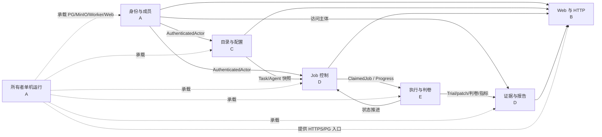

# 五人模块分工、上下游交接与排队任务分配

> 状态：2026-09-18 已按用户要求完成五人分工，并确认采用“一套共享 PostgreSQL、一个管理员账号、五人直连”的课设协作方式；成员 A–E 是稳定占位，A 代表 owner，其余姓名待组内填写。
>
> 适用范围：AgentExam 五人课设的开发、联调、验收和 owner 部署协作。
>
> 权威范围：本文只维护人员 DRI（直接负责人）、Module 间交接和排队任务归属。字段/错误由模块契约维护，路由由 HTTP 文档维护，表结构由数据模型维护，任务步骤仍以各任务/计划原文为准。

## 1. 分工结论

每个 Module 只有一个长期 DRI。任务可以跨多个 Module，但任务 DRI 只负责组织交接，不自动取得其他 Module 内部实现的所有权。

| 成员 | 长期负责 Module | 当前任务 DRI | 计划开发工时 |
|---|---|---|---:|
| **A（owner／项目负责人）** | 身份与成员、所有者单机运行 | M1-14 私有双机协作验收 | 52 h |
| **B（前端与 HTTP 负责人）** | Web 与 HTTP | 01 原型、02 提交审批 UI、03 对比报告 UI | 55 h |
| **C（目录与配置负责人）** | 目录与配置 | 04 新题与连续规模 | 54 h |
| **D（流程与报告负责人）** | Job 控制、证据与报告 | 08 冻结矩阵与全量回归 | 55 h |
| **E（执行链负责人）** | 执行与判卷 | 05 假提供方安全链、06 DeepSeek、07 Kimi | 56 h |

最大计划差为 4 小时。估算用于初始平衡，不是工期承诺；不包含软件下载、镜像/数据下载、等待用户确认、真实模型运行、外部限流、评审返工和课堂材料整理。每个任务正式发布时按现实范围重新估算，偏差超过 8 小时时由任务 DRI提出调平方案。

### 1.1 共享数据库方式

- 全组只使用 owner 电脑上的一套 PostgreSQL，不要求其他四人部署数据库。
- 五个人共用 `agentexam_admin` 管理员账号，通过 `sss.tail03c757.ts.net:15432` 直连，可以查看和修改全部表。
- owner 只负责保持电脑、Docker Desktop、PostgreSQL 容器和 Tailscale 在线，不负责为每个人维护单独数据库。
- Module 分工表示代码主责，不代表数据库角色或表权限；不建立只读账号、分角色账号或独立开发库。
- 组员实际连接只需登录 Tailscale，并在 Navicat 中填写 Host、Port、Initial Database、Username、Password；详见[极简连接教程](../../operations/TEAM_POSTGRESQL_CONNECTION.md)。

### 1.2 姓名填写区

| 占位 | 姓名 | 联系方式/常用时间 |
|---|---|---|
| A | owner（当前用户） | 待组内填写 |
| B | 待填写 | 待组内填写 |
| C | 待填写 | 待组内填写 |
| D | 待填写 | 待组内填写 |
| E | 待填写 | 待组内填写 |

替换姓名不改变 Module 归属；若要交换 Module，必须同时更新本文的任务表、工时和交接关系。

## 2. 统一协作规则

本文把“上游”定义为向当前 Module 提供请求、可信数据或运行前置能力的一方，把“下游”定义为消费当前 Module 稳定输出的一方。同一调用链可能同时有请求和响应，代码依赖方向仍以本节第 3 条及模块架构为准。

1. **一个 Module 一个 DRI。** DRI 对该 Module 的 Interface、不变量、内部文件组织、测试和文档一致性负责。
2. **任务 DRI 不等于全仓负责人。** 跨 Module 任务由任务 DRI排期和收口；每个 Module 的实际改动仍由该 Module DRI实施或审核。
3. **产品代码通过 Interface 交接。** 上游必须给出调用输入、成功输出、稳定错误、顺序/权限约束和最小可运行示例；产品代码不能读取其他 Module 的表或内部文件来绕开 Interface。组员人工使用 Navicat 查看、修改共享库不受这条限制。
4. **共享管理员与代码分工是两回事。** 五人都能用 `agentexam_admin` 查看、增加、修改和删除数据库内容；Module DRI 只表示对应代码由谁主责，不限制数据库权限。执行删库、`DROP`、`TRUNCATE` 或大批量删除前在组内说明，结构变化同时落到项目 schema／迁移文件。
5. **契约先于联调。** Interface 变化由提供方 DRI先更新契约、用例和兼容说明，再交给调用方；旧快照和旧错误行为不能被静默重解释。
6. **每次交接必须可验证。** 至少包含关联任务/行动、修改树、输入输出示例、通过与失败用例、实际检查结果、未验证项和回退方法。
7. **分工不等于全部开工。** 01–02 已发布并完成；03–08 仍是未发布的规划编号。实施顺序仍按计划和用户当次安排；M1-14 已发布且在进行中，可继续补剩余验收。

## 3. Module 依赖总览



稳定依赖方向仍是 `Web/CLI → delivery → application → domain/ports ← Adapter`。人可以跨任务协作，但代码不能反向依赖 Web、数据库 Adapter 或具体 Harbor 对象。

## 4. 各 Module 的输入、职责、输出和下游

### 4.0 JSON 示例阅读规则

- 示例按 2026-09-18 的当前代码填写；`swe-gym-lite-mypy-15413`、`codex-0153-terra-medium`、`closed_book`、`demo`、固定 revision 和限制值均来自现有实现。
- UUID、时间、摘要和题面文字是可解析的示例值，不代表当前数据库已经存在对应记录；服务端实际创建时应使用真实返回值，不能照抄示例 ID。
- 标为“实际 HTTP”的 JSON 就是请求或响应 body；Cookie、`Origin`、`Idempotency-Key` 等放在 JSON 之外说明。标为“内部 Interface 的 JSON 表示”的内容对应 Python dataclass/Protocol，只用于交接和测试夹具阅读，不是新增 HTTP 端点。
- `<...>` 是有意遮蔽的运行时值。示例不会保存真实密码、会话 token、邀请码、模型 Key、MinIO 对象键或宿主机私有绝对路径。
- 失败响应只有在当前边界确实定义 JSON 时才写成真实 JSON；PowerShell 这类进程失败若本来是非零退出和 stderr，会明确标成“进程捕获表示”，不伪称脚本返回了 JSON。

### 4.1 身份与成员 Module — A

**上游提供：**

- Web/HTTP 提供规范化的登录、退出、邀请兑换和成员管理请求；
- owner 本机入口提供首次 owner 建立、恢复和显式升级命令；
- 所有者单机运行提供 PostgreSQL 可用性和私有配置。

**本 Module 负责：**

- 唯一 owner、collaborator 邀请/停用、Argon2 密码验证、会话签发/失效；
- 统一 `AuthenticatedActor`、角色与身份错误；
- 保证密码、会话 token、邀请码只以受控形式处理，原文不进入日志和下游 Module。

**向下游输出：**

- 给 Web/HTTP：登录结果、会话 Cookie 语义、成员 DTO 和稳定错误；
- 给目录、Job、证据报告：可信 `AuthenticatedActor` 和账号状态；
- 给 owner：本机恢复结果和旧会话失效证据。

**交接完成标准：** 调用方只需要 actor 和稳定错误，不需要知道哈希、SQL 或事务；未登录、停用成员、协作者越权和 owner 自保护用例通过。

#### 当前 JSON 交接示例

类型：实际 HTTP。B 调用 `POST /api/v1/auth/login` 时，body 只含用户名和密码；真实密码只在用户提交当次存在，不能进入任务单、日志或测试快照。

输入 body：

```json
{
  "username": "collab_a",
  "password": "<仅在运行时填写，不写入文档>"
}
```

成功 `200` body：

```json
{
  "user_id": "00000000-0000-0000-0000-000000000001",
  "username": "collab_a",
  "role": "collaborator"
}
```

会话值不在 JSON 中返回，而是由 Web/HTTP Module 写入 `Secure`、`HttpOnly`、`SameSite=Strict` 的 `__Host-agentexam_session` Cookie。目录、Job、报告 Module 收到的是与成功 body 同字段的可信 `AuthenticatedActor`，不会收到密码或 Cookie 原文。

失败 `401` body：

```json
{
  "error": {
    "code": "AUTHENTICATION_REQUIRED",
    "message": "登录无效或已失效，请重新登录",
    "details": {},
    "request_id": "req_00000000000000000000000000000001"
  }
}
```

下游据此只能按 `error.code` 分支；账号不存在、密码错误、会话过期和会话撤销不能靠文案或不同 body 被区分。

**对应排队任务：** 02 提供两角色会话/权限；M1-14 验证远程两角色；08 参加身份与越权回归。当前无独立身份重写任务。

### 4.2 目录与配置 Module — C

**上游提供：**

- 身份 Module 提供 actor；
- 固定 SWE-Gym 数据、镜像身份和用户批准的题目/模型候选；
- 所有者单机运行提供 PostgreSQL、MinIO 和固定数据位置；
- 执行与判卷提供资格验证结果和可执行配置限制。

**本 Module 负责：**

- 可信 Task Catalog、Agent Registry、预设 allowlist、不可变摘要和禁用语义；
- 题目公开/隐藏数据分离，目录记录与对象摘要一致；
- 新规模/配置版本兼容，历史配置指纹和旧 Job 快照不可被改写。

**向下游输出：**

- 给 Web/HTTP：不含秘密的任务、配置 options 和管理结果；
- 给 Job 控制：可冻结的 `TaskSnapshot`、`AgentSnapshot`、限制和指纹；
- 给执行与判卷：已经登记、身份固定的题目和 Agent Configuration。

**交接完成标准：** 每个目录项都有固定来源、摘要、启用状态和兼容版本；未知/停用/漂移条目明确拒绝；Key、隐藏答案和任意 URL 不进入公开输出。

#### 当前 JSON 交接示例

类型：实际 HTTP。目录有“登记任务”和“登记 Agent 配置”两个独立 Interface，均只接受服务端 allowlist 中的 `preset_id`。

登记当前固定任务的输入 body：

```json
{
  "preset_id": "swe-gym-lite-mypy-15413"
}
```

成功 `201` 的 `TaskDetail` body：

```json
{
  "task_id": "00000000-0000-0000-0000-000000000101",
  "instance_id": "python__mypy-15413",
  "dataset_id": "SWE-Gym/SWE-Gym-Lite",
  "dataset_revision": "61231f2c90b18985b42a1419738a240085a15107",
  "split": "train",
  "repo": "python/mypy",
  "base_commit": "0123456789abcdef0123456789abcdef01234567",
  "problem_statement_preview": "示例题面预览；正式响应返回固定数据集中的前 240 个字符。",
  "problem_statement": "示例题面全文；正式响应返回固定数据集中的公开问题描述。"
}
```

登记当前 Codex 配置的输入 body：

```json
{
  "preset_id": "codex-0153-terra-medium"
}
```

成功 `201` 的 `AgentDetail` body：

```json
{
  "agent_configuration_id": "00000000-0000-0000-0000-000000000102",
  "display_name": "Codex 0.153.0 / gpt-5.6-terra / medium",
  "agent_type": "codex",
  "agent_version": "0.153.0",
  "model_provider": "openai_chatgpt",
  "model": "gpt-5.6-terra",
  "configuration_fingerprint": "ea6b1f64aceaecd8ad5ba7cadb2aed37e91200e5a47c809244d8eae499dab590",
  "enabled": true,
  "public_options": {
    "reasoning_effort": "medium"
  },
  "limit_profile_id": null
}
```

未知预设的失败 `400` body：

```json
{
  "error": {
    "code": "INVALID_REQUEST",
    "message": "目录选择无效",
    "details": {},
    "request_id": "req_00000000000000000000000000000002"
  }
}
```

Job 控制只保存服务端返回的 UUID、公开快照和 fingerprint；`gold_patch`、`test_patch`、测试名单、环境对象键、`credential_profile_id` 和认证文件内容均不在以上 HTTP 输出中。

**对应排队任务：** 03 目录管理动线；04 主责五题入库和 1–20 规模；05–07 提供受控 provider 配置；08 冻结六题×两配置目录身份。

### 4.3 Job 控制 Module — D

**上游提供：**

- 身份 Module 提供 actor；
- 目录与配置提供可冻结任务/配置/规模；
- Web/HTTP 提供已校验的提交、批准、取消和恢复意图；
- 所有者单机运行提供 PostgreSQL 和 Worker 生命周期。

**本 Module 负责：**

- 原子创建 Job×Run 矩阵、幂等、等待 owner 批准、队列 claim/lease；
- 状态/事件推进、取消、崩溃收束和显式新 Job 重试；
- 保证单重型 Job、每组合一次尝试、零自动重试。

**向下游输出：**

- 给执行与判卷：完整 `ClaimedJob`、冻结 Run、进度/取消 Interface；
- 给证据与报告：可信 Job/Run 身份、终态、结果索引和审计；
- 给 Web/HTTP：可见 Job、审批/取消/恢复结果和稳定错误。

**交接完成标准：** 所有状态只能按契约推进；并发批准/取消/claim 只有一个合法结果；数据库失败不留下半个矩阵；恢复不自动重跑旧 Job。

#### 当前 JSON 交接示例

类型：实际 HTTP。B 向 `POST /api/v1/jobs` 发送下列 body；另带 8–128 位 `Idempotency-Key` Header，幂等键原文不写入数据库。

输入 body：

```json
{
  "task_ids": [
    "00000000-0000-0000-0000-000000000101"
  ],
  "agent_configuration_ids": [
    "00000000-0000-0000-0000-000000000102"
  ],
  "evaluation_track": "closed_book",
  "batch_preset": "demo",
  "limit_profile_id": "default-single-host-v1"
}
```

成功 `202` body：

```json
{
  "job_id": "00000000-0000-0000-0000-000000000103",
  "status": "AWAITING_OWNER_APPROVAL",
  "evaluation_track": "closed_book",
  "result_scope": "official",
  "batch_preset": "demo",
  "limit_profile_id": "default-single-host-v1",
  "trial_count": 1,
  "run_ids": [
    "00000000-0000-0000-0000-000000000104"
  ],
  "estimated_finish_at": null,
  "created_at": "2026-09-18T10:00:00Z",
  "owner_decided_by": null,
  "owner_decided_at": null,
  "owner_decision_reason": null,
  "cancel_requested_by": null,
  "cancel_requested_at": null,
  "cancel_reason": null,
  "failure_code": null,
  "failure_summary": null,
  "rerun_of_job_id": null
}
```

规模与 preset 不匹配时的失败 `400` body：

```json
{
  "error": {
    "code": "BATCH_PRESET_EXCEEDED",
    "message": "评测批次选择无效",
    "details": {},
    "request_id": "req_00000000000000000000000000000003"
  }
}
```

这个成功输出只代表矩阵和 `PENDING` Runs 已原子保存并等待 owner 决定，不代表 Harbor、Agent 或判卷已经启动。owner 批准后，Worker 从内部 `ClaimedJob` 恢复冻结 Task/Agent/限制，再转换成 4.4 的 `ExecutionJobRequest`；E 不重新读取当前目录来改写旧 Job。

**对应排队任务：** 02 提交/批准闭环；04 新规模和最多 60 Runs；05–07 provider 运行的状态/限额/取消协作；08 矩阵执行和全量状态回归。

### 4.4 执行与判卷 Module — E

**上游提供：**

- Job 控制提供 `ClaimedJob`、冻结 Run 和进度 Interface；
- 目录与配置提供已登记的任务/模型配置身份；
- 所有者单机运行提供 Docker、Harbor、固定 Fork、数据、代理和受控秘密绑定。

**本 Module 负责：**

- `ExecutionBackend`、Harbor Adapter、provider 内部绑定、网络/超时/清理；
- 采集同一 patch，并由固定 `PatchEvaluator` 在独立环境判卷；
- 规范化执行失败、确定性结果、用量/未知和过程指标，不用模型自述替代判卷。

**向下游输出：**

- 给 Job 控制：Trial 进度、失败分类和终态所需结果；
- 给证据与报告：受校验 patch、判卷输出、指标、公开/原始证据输入；
- 给 owner：本轮资源、清理和真实调用次数的可核验证据。

**交接完成标准：** 一 Run 一 Trial、一次尝试、零自动重试；同一 patch 被独立判卷；秘密不进入 Job/HTTP/DB/制品；专属容器/网络/进程可精确清理。

#### 当前 JSON 交接示例

类型：内部 Interface 的 JSON 表示。真实调用是 `ExecutionBackend.execute(ExecutionJobRequest)` 和 `PatchEvaluator.evaluate(EvaluationRequest)`；下面把 frozen dataclass 展开成 JSON 便于 D、E 对字段，不能把它注册成公网 API。

Job 控制交给执行后端的 `ExecutionJobRequest`：

```json
{
  "job_id": "00000000-0000-0000-0000-000000000103",
  "evaluation_track": "closed_book",
  "backend_revision": "6af8d6e31eced13b93849cdf80feeadf24603d15",
  "artifact_contract_version": "agentexam.m0.v1",
  "limits": {
    "wall_timeout_sec": 900,
    "cpus": 1,
    "memory_mb": 4096,
    "storage_mb": 8192
  },
  "runs": [
    {
      "run_id": "00000000-0000-0000-0000-000000000104",
      "attempt_index": 1,
      "task": {
        "dataset_id": "SWE-Gym/SWE-Gym-Lite",
        "dataset_revision": "61231f2c90b18985b42a1419738a240085a15107",
        "split": "train",
        "instance_id": "python__mypy-15413",
        "repo": "python/mypy",
        "base_commit": "0123456789abcdef0123456789abcdef01234567",
        "problem_statement": "示例公开题面；实际值来自 Job 创建时冻结的 TaskSnapshot。",
        "environment_image": "xingyaoww/sweb.eval.x86_64.python_s_mypy-15413@sha256:f069dfc74592d438ad870bbc6dfb369bff1b125d21237ead49190b414f5f3456",
        "raw_record_sha256": "1111111111111111111111111111111111111111111111111111111111111111"
      },
      "agent": {
        "configuration_id": "00000000-0000-0000-0000-000000000102",
        "agent_name": "codex",
        "agent_version": "0.153.0",
        "model_provider": "openai_chatgpt",
        "model_name": "gpt-5.6-terra",
        "authentication_type": "chatgpt_auth_json",
        "credential_configuration_id": "owner-codex",
        "critical_config": {
          "reasoning_effort": "medium"
        }
      }
    }
  ]
}
```

其中 `credential_configuration_id` 只是 owner 主机内受控凭据的逻辑引用，不是 `auth.json` 内容。E 只能让 Adapter 在运行时解析该引用，不能把它回传给 HTTP、复制进制品或交给其他成员。

执行后端成功返回的 `ExecutionTrialResult`：

```json
{
  "run_id": "00000000-0000-0000-0000-000000000104",
  "backend_job_ref": "harbor-job-example-001",
  "backend_trial_ref": "harbor-trial-example-001",
  "termination_reason": "completed",
  "patch_ref": {
    "object_key": "<内部临时文件身份；不进入 HTTP 或交接文档>",
    "artifact_type": "model_patch",
    "size_bytes": 842,
    "sha256": "2222222222222222222222222222222222222222222222222222222222222222",
    "content_type": "text/x-diff",
    "retention_class": "prototype",
    "truncated": false,
    "deleted_at": null,
    "created_at": "2026-09-18T10:15:00Z",
    "warnings": [],
    "original_filename": null,
    "original_size_bytes": null,
    "expires_at": null,
    "deleted_by": null,
    "deletion_reason": null
  },
  "trajectory_ref": {
    "object_key": "<内部临时文件身份；不进入 HTTP 或交接文档>",
    "artifact_type": "agent_trajectory",
    "size_bytes": 4096,
    "sha256": "3333333333333333333333333333333333333333333333333333333333333333",
    "content_type": "application/json",
    "retention_class": "prototype",
    "truncated": false,
    "deleted_at": null,
    "created_at": "2026-09-18T10:15:00Z",
    "warnings": [],
    "original_filename": null,
    "original_size_bytes": null,
    "expires_at": null,
    "deleted_by": null,
    "deletion_reason": null
  },
  "raw_config_ref": null,
  "raw_result_ref": null,
  "usage": null,
  "resource_summary": {
    "wall_time_sec": 138.4,
    "cpu_time_sec": null,
    "peak_memory_bytes": null
  },
  "warnings": []
}
```

`usage=null` 表示上游没有给出任何可信用量；若只缺部分值，则对应的 token 或 `cost_usd` 字段保持 `null`。报告 Module 不能把未知改写成 `0`。验证过 patch 身份、大小、SHA-256、UTF-8 与 diff 格式后，固定 Fork 的 `DeterministicResult` 形状为：

```json
{
  "run_id": "00000000-0000-0000-0000-000000000104",
  "resolved": true,
  "patch_applied": true,
  "report_ref": {
    "object_key": "<内部判卷证据身份；由 Evidence Adapter 持久化>",
    "artifact_type": "harness_report",
    "size_bytes": 1536,
    "sha256": "4444444444444444444444444444444444444444444444444444444444444444",
    "content_type": "application/json",
    "retention_class": "prototype",
    "truncated": false,
    "deleted_at": null,
    "created_at": null,
    "warnings": [],
    "original_filename": null,
    "original_size_bytes": null,
    "expires_at": null,
    "deleted_by": null,
    "deletion_reason": null
  },
  "log_refs": [],
  "tests_status_summary": {
    "FAIL_TO_PASS": {
      "success": 1,
      "failure": 0
    },
    "PASS_TO_PASS": {
      "success": 12,
      "failure": 0
    }
  },
  "duration_ms": null
}
```

执行超时并不是 HTTP 错误，而是同一内部结果类型的受控失败输出：

```json
{
  "run_id": "00000000-0000-0000-0000-000000000104",
  "backend_job_ref": "harbor-job-example-001",
  "backend_trial_ref": "harbor-trial-example-001",
  "termination_reason": "timed_out",
  "patch_ref": null,
  "trajectory_ref": null,
  "raw_config_ref": null,
  "raw_result_ref": null,
  "usage": null,
  "resource_summary": {
    "wall_time_sec": 900.0,
    "cpu_time_sec": null,
    "peak_memory_bytes": null
  },
  "warnings": []
}
```

D 据此把 Run 置为明确的失败分类；它不能伪造 `resolved=false`，也不能在后台自动开始第二次尝试。

**对应排队任务：** 04 配合五题固定 Fork 资格验证；05 主责假提供方安全执行链；06/07 主责真实 provider 单题；08 执行冻结矩阵。

### 4.5 证据与报告 Module — D

**上游提供：**

- 执行与判卷提供 patch、确定性结果、指标和证据输入；
- Job 控制提供 Job/Run 身份、终态和 actor 可见范围；
- 所有者单机运行提供 PostgreSQL 与 MinIO。

**本 Module 负责：**

- 制品不可变写入、摘要回读、索引事务、报告完整性和权限；
- 单 Run/批次报告、轨迹、排行榜、原始证据保留与删除审计；
- 区分 `false`、基础设施失败、未完成、缺失与 `unknown`，不把缺失写成 0。

**向下游输出：**

- 给 Web/HTTP：授权后的报告 DTO、制品/轨迹流和排行榜；
- 给 owner/任务 DRI：可复查的运行结论、缺失项、清理审计和对比矩阵数据。

**交接完成标准：** MinIO 正文与 PostgreSQL 索引摘要一致；无权限、缺失、损坏、过期分别失败；报告不泄漏对象键、秘密路径或私有原文。

#### 当前 JSON 交接示例

类型：实际 HTTP，但 GET 没有请求 body。下面第一个 JSON 是便于 B/D 交接的“请求描述”，不是发给 FastAPI 的 body；真实调用为 `GET /api/v1/reports/runs/{run_id}` 并携带会话 Cookie。

输入请求描述：

```json
{
  "method": "GET",
  "path": "/api/v1/reports/runs/00000000-0000-0000-0000-000000000104",
  "query": {}
}
```

成功 `200` 的 `RunReportResponse` body：

```json
{
  "run": {
    "run_id": "00000000-0000-0000-0000-000000000104",
    "job_id": "00000000-0000-0000-0000-000000000103",
    "status": "COMPLETED",
    "stage": "completed",
    "task_instance_id": "python__mypy-15413",
    "agent_configuration_id": "00000000-0000-0000-0000-000000000102",
    "backend_job_ref": "harbor-job-example-001",
    "backend_trial_ref": "harbor-trial-example-001",
    "failure_code": null,
    "failure_summary": null,
    "started_at": "2026-09-18T10:12:00Z",
    "finished_at": "2026-09-18T10:17:00Z",
    "warnings": []
  },
  "deterministic_result": {
    "patch_exists": true,
    "patch_successfully_applied": true,
    "resolved": true,
    "tests_status_summary": {
      "FAIL_TO_PASS": {
        "success": 1,
        "failure": 0
      },
      "PASS_TO_PASS": {
        "success": 12,
        "failure": 0
      }
    },
    "harness_revision": "242429c188fcfd06aad13fce9a54d450470bf0ac",
    "duration_ms": null
  },
  "process_metrics": {
    "usage": {
      "n_input_tokens": null,
      "n_cache_tokens": null,
      "n_output_tokens": null,
      "cost_usd": null
    },
    "resources": {
      "wall_time_sec": 138.4,
      "cpu_time_sec": null,
      "peak_memory_bytes": null
    }
  },
  "judge_analyses": [],
  "human_review": null,
  "quality_tiebreak": null,
  "review_status": "NOT_REQUIRED",
  "artifact_links": [
    {
      "artifact_id": "00000000-0000-0000-0000-000000000105",
      "artifact_type": "agent_patch",
      "content_type": "text/x-diff",
      "size_bytes": 842,
      "sha256": "2222222222222222222222222222222222222222222222222222222222222222",
      "created_at": "2026-09-18T10:15:00Z",
      "redaction_status": "not_required",
      "warnings": [],
      "retention_class": "long_term",
      "original_size_bytes": 842,
      "truncated": false,
      "expires_at": null,
      "deleted_at": null,
      "deleted_by": null,
      "deletion_reason": null,
      "content_status": "available"
    }
  ]
}
```

无权查看和不存在的 Run 都收敛为同一种失败 `404`，避免泄漏资源存在性：

```json
{
  "error": {
    "code": "JOB_NOT_FOUND",
    "message": "评测批次不存在",
    "details": {},
    "request_id": "req_00000000000000000000000000000004"
  }
}
```

基础设施失败时 `deterministic_result` 必须是 `null`，并在 `run.failure_code/failure_summary` 说明；未拿到可信用量时保持 `null`。B 只使用 `artifact_id` 下载公开证据，永远不会收到 MinIO `object_key`。

**对应排队任务：** 03 主导报告语义并与 B 交接展示；05–07 接 provider 用量/失败证据；08 主责最终矩阵汇总和验收报告；M1-14 配合远程结果读取证据。

### 4.6 Web 与 HTTP Module — B

**上游提供：**

- A 提供身份/成员 Interface；C 提供目录 Interface；D 提供 Job、报告和证据 Interface；
- 所有者单机运行提供 HTTPS public origin、回环 FastAPI 和 Tailscale 入口。

**本 Module 负责：**

- FastAPI HTTP Adapter、稳定 DTO/错误、安全 Cookie/同源写入；
- Next.js 同源 `/api/v1` 转发、两角色工作台、向导、详情和响应式页面；
- 浏览器运行时形状校验、错误呈现和 Playwright 动线。

**向下游输出：**

- 给 owner/collaborator：可操作的私有站点；
- 给其他 Module：只做 Interface 翻译的 HTTP 入口，不泄漏数据库或框架内部值；
- 给 M1-14/08：桌面和手机浏览器验收结果。

**交接完成标准：** 浏览器不直连 FastAPI/PG/MinIO；服务器权限不依赖隐藏按钮；刷新/重复点击/超时/空状态/移动端均有明确结果；未知响应失败关闭。

#### 当前 JSON 交接示例

类型：HTTP 交换的 JSON 表示，不是额外业务 body。它把浏览器请求的 method、path、Header、Cookie 和 body 放在一个对象里，方便 B 与各后端 Module 对照完整边界。

通过当前 tailnet HTTPS 站点提交 Job 的请求：

```json
{
  "method": "POST",
  "path": "/api/v1/jobs",
  "headers": {
    "Content-Type": "application/json",
    "Origin": "https://sss.tail03c757.ts.net",
    "X-AgentExam-Request": "1",
    "Idempotency-Key": "job-create-example-0001"
  },
  "cookies": {
    "__Host-agentexam_session": "<浏览器托管的 HttpOnly 会话值>"
  },
  "body": {
    "task_ids": [
      "00000000-0000-0000-0000-000000000101"
    ],
    "agent_configuration_ids": [
      "00000000-0000-0000-0000-000000000102"
    ],
    "evaluation_track": "closed_book",
    "batch_preset": "demo",
    "limit_profile_id": "default-single-host-v1"
  }
}
```

Web/HTTP Adapter 返回给浏览器的成功交换：

```json
{
  "status": 202,
  "headers": {
    "Cache-Control": "no-store",
    "Content-Type": "application/json"
  },
  "body": {
    "job_id": "00000000-0000-0000-0000-000000000103",
    "status": "AWAITING_OWNER_APPROVAL",
    "evaluation_track": "closed_book",
    "result_scope": "official",
    "batch_preset": "demo",
    "limit_profile_id": "default-single-host-v1",
    "trial_count": 1,
    "run_ids": [
      "00000000-0000-0000-0000-000000000104"
    ],
    "estimated_finish_at": null,
    "created_at": "2026-09-18T10:00:00Z",
    "owner_decided_by": null,
    "owner_decided_at": null,
    "owner_decision_reason": null,
    "cancel_requested_by": null,
    "cancel_requested_at": null,
    "cancel_reason": null,
    "failure_code": null,
    "failure_summary": null,
    "rerun_of_job_id": null
  }
}
```

`Origin` 不等于配置的 public origin，或缺少 `X-AgentExam-Request: 1` 时，Adapter 在进入 Job 应用服务前就返回：

```json
{
  "status": 403,
  "headers": {
    "Cache-Control": "no-store",
    "Content-Type": "application/json"
  },
  "body": {
    "error": {
      "code": "FORBIDDEN",
      "message": "请求来源不可信",
      "details": {},
      "request_id": "req_00000000000000000000000000000005"
    }
  }
}
```

Next.js 只把同源 `/api/v1/*` 转给本机回环 FastAPI，并按既有响应形状校验；它不把数据库行、Python 异常、内部对象键或容器地址拼进前端 DTO。

**对应排队任务：** 01–03 主责；04 接入新 options/规模；06/07 显示真实运行结果；08 完整浏览器回归；M1-14 配合双机 Web 验收。

### 4.7 所有者单机运行 Module — A

**上游提供：**

- 各业务 Module 提供可装配的 Adapter、schema 和运行要求；
- owner 提供本机、Docker Desktop、Tailscale、共享数据库管理员密码、受控数据/秘密和实际启停窗口。

**本 Module 负责：**

- PostgreSQL/MinIO 持久化、显式初始化、手动启停、Worker 组合与主机容量；
- Web HTTPS 与共享 PostgreSQL `15432` 的 tailnet 入口；五人共用管理员账号直连，MinIO/原始 FastAPI/Docker/秘密不开放；
- 真实运行授权门禁、环境状态、部署日志和服务恢复。

**向下游输出：**

- 给身份、目录、Job、证据：长期 PG/MinIO 可用性和配置；
- 给执行：Docker/Harbor/Fork/私有 provider 绑定和受控 Worker；
- 给 Web/成员：可访问的 HTTPS，以及只需 Host、Port、Database、Username、Password 的共享 PostgreSQL 管理入口；
- 给任务 DRI：部署状态、网络正反例和停机/恢复证据。

**交接完成标准：** 服务可手动启停且不随开机自动运行；数据跨正常启停/容器重建/电脑重启保留；入口范围与文档一致；运行失败不自动调用模型或清库。

#### 当前 JSON 交接示例

类型：实际 PowerShell 成功输出。`Get-AgentExamStatus.ps1` 的 `param()` 为空，因此输入参数可表示为 `{}`：

```json
{}
```

脚本成功时输出下列结构。2026-09-18 本轮因主机尚不能识别 `pwsh`，没有伪称已直接运行该脚本；下面的当前值由部署状态文件 `phase=complete`、两个容器均为 `running` 和 PostgreSQL 只读查询 `activeJobs=0` 交叉核对，字段名称则逐项来自 `Get-AgentExamLifecycleStatus`：

```json
{
  "project": "agentexam-local",
  "initializationState": "complete",
  "services": {
    "postgres": "running",
    "minio": "running"
  },
  "worker": {
    "activeJobs": 0,
    "stopRequested": false
  }
}
```

当前远程入口的交接表示如下。它是对 `tailscale serve status` 与容器端口的规范化记录，不是 Tailscale CLI 自己返回的 JSON：

```json
{
  "scope": "tailnet_only",
  "web": {
    "url": "https://sss.tail03c757.ts.net",
    "target": "http://127.0.0.1:59336"
  },
  "postgresql": {
    "host": "sss.tail03c757.ts.net",
    "tailscale_ipv4": "100.101.148.2",
    "port": 15432,
    "target": "tcp://127.0.0.1:55432",
    "tcp_test_succeeded": true
  },
  "not_exposed_to_tailnet": [
    "minio:59000",
    "raw-fastapi",
    "docker-api",
    "worker-control",
    "model-secrets"
  ]
}
```

当前 PowerShell 入口不可用时，实际失败不是 JSON；进程以命令未找到结束。交接/CI 若要记录成 JSON，应使用下列“进程捕获表示”，不能声称这是 `Get-AgentExamStatus.ps1` 的响应 body：

```json
{
  "process_exit_code": 1,
  "command": "pwsh -NoProfile -File .\\infra\\local\\Get-AgentExamStatus.ps1",
  "failure_kind": "COMMAND_NOT_FOUND",
  "stderr_summary": "pwsh 未安装或未加入 PATH；尚未执行状态脚本。"
}
```

组员只消费 HTTPS URL 和 PostgreSQL 主机/端口；业务 Module 消费的是本机 PG/MinIO 可用性。任何失败都必须停在部署诊断，不自动初始化、删除数据、重跑 Job 或调用模型。

**对应任务：** P 已完成并转维护；M1-14 主责剩余远程验收；05–07 提供代理/秘密/真实调用环境；08 负责正式部署窗口和最终运行环境。

## 5. 排队任务到人员与 Module 的映射

任务来源：扩展 [01–08 执行计划](../../../.scratch/ui-catalog-providers/plan.md)；已发布的 [M1-14 任务单](../../../.scratch/m1-platform/issues/14-private-remote-acceptance.md)。

| 任务 | 当前状态 | 任务 DRI | 参与 Module 与各自交付 | 必须从上游取得 | 交付给下游/停点 |
|---|---|---|---|---|---|
| **M1-14 私有双机协作验收** | 已发布、进行中 | **A** | A：Tailscale/主机/身份；B：HTTPS Web 与浏览器；D：Job/报告证据。PostgreSQL `15432` 共享管理员是新获准入口；MinIO/原始 FastAPI/Docker仍拒绝 | 现有正式存储、Web、角色账号、ALLOWED/DENIED 设备参与 | 正反设备、VPN 双态、离线恢复、组员 Navicat、回归/评审；完成前不宣布 M1 全部完成 |
| **01 可点击 HTML 原型** | 已完成；用户选择纯 A 侧栏工作台 | **B** | B：三套布局、角色/状态/手机原型；A/C/D：审核权限、目录和状态文案，不改产品代码 | 现有页面/API事实和用户交互偏好 | A 版页面/交互基线；B/C 仅历史比较；已停在任务 01 |
| **02 两角色首页、列表、提交/审批** | 已完成；32 条浏览器回归、构建、31 项 API 对账和双轴评审通过 | **B** | B：A 版工作台/向导/浏览器与逐控件契约表；A：会话/角色；C：选项；D：提交、审批、取消/恢复契约 | 01 选定 A；现有身份、目录和 Job Interface；每个交互先映射契约或标无后端请求 | 两角色真实 UI 闭环及兼容 HTTP；未改批次规模，已在任务 02 停止 |
| **03 对比报告、详情、目录管理** | 已规划、未发布 issue | **B** | B：矩阵/详情/导航；D：报告、证据和缺失语义；C：目录；A：成员/保留权限 | 02 导航/会话壳和选定报告原型 | 可钻取对比报告、单次证据、目录/成员动线；用户确认后停 |
| **04 五道新题与 1–20 规模** | 已规划、未发布 issue | **C** | C：题目目录、preset、规模版本；E：参考/空/错误补丁的 Fork 资格验证；D：Job 快照/60 Runs/兼容；B：options/向导；A：磁盘与长期 schema 变更窗口 | 固定数据、镜像和下载授权；旧题/旧快照；03 按当前节奏完成 | 至少六题可选、连续规模可提交、隐藏答案不泄漏；不调用模型，完成后停 |
| **05 假提供方安全执行链** | 已规划、未发布 issue | **E** | E：provider 代理、网络/请求策略、假工具循环；C：受控配置；D：额度、状态、报告；A：私有文件/容器拓扑；B：仅必要错误呈现 | P 已完成；冻结安全合同；假 Key/假上游 | 正式链合成 Run、安全负例和精确清理；未通过不得进入真实 Key |
| **06 DeepSeek 单题** | 已规划、未发布 issue | **E** | E：原生接口/工具/执行；C：DeepSeek 固定预设；D：Job/用量/报告；A：私有 Key、授权和环境；B：结果展示回归 | 05 全部门禁、当前官方型号/地区/额度核验、单独真实调用授权 | 一次真实旧题、零重试、判卷/费用/清理证据；无论解题与否都停 |
| **07 Kimi 单题** | 已规划、未发布 issue | **E** | E：开放平台原生接口；C：Kimi 固定预设；D：Job/用量/报告；A：Key/账户/环境；B：展示回归 | 05 全部门禁、Kimi 开放平台资格和单独授权；按当前节奏在 06 后 | 一次真实旧题、订阅端点拒绝证据、判卷/费用/清理；完成后停 |
| **08 冻结矩阵与全量回归** | 已规划、未发布 issue | **D** | D：12 Run 矩阵、状态/报告、验证清单和总结；A：正式运行窗口/部署；B：页面/浏览器；C：六题×两配置身份；E：单并发执行/判卷/清理 | 03、04、06、07 已验收；再次确认价格、预算和真实授权 | 可复查对比报告、全量回归、双轴评审和逐项结论；M1-14 未完则仍不能宣布整个 MVP 完成 |

### 5.1 P 阶段不再排队

P（长期 PostgreSQL/MinIO 持久化与手动启停）已完成，负责人 A 转为维护。04–07 若改变 schema 或运行要求，由对应 Module DRI先给 A 提供迁移/部署输入；不能重复执行初始化冒充升级。本课设已取消备份恢复范围，任务分配不得把它重新加入隐藏工作量。

### 5.2 当前执行顺序

- M1-14 是独立未关闭任务，由 A 继续收尾。
- 扩展任务保持 `01 → 02 → 03 → 04 → 05 → 06 → 07 → 08` 的当前计划顺序。
- 分工完成后，各成员可以提前阅读自己 Module 和准备测试设计，但在任务未发布/用户未安排时，不提前修改后续任务代码、不调用真实模型、不下载大体量镜像。
- 如果以后要让多任务并行开发，应先单独修改执行计划，明确可以并行的文件树、Interface 冻结点和合并顺序；本分工文档不自动授权并行越阶段。

## 6. 工时拆分依据

| 成员 | 主要工作切片 | 小计 |
|---|---|---:|
| A | 身份/权限支持 6h；M1-14 与主机入口 14h；05 安全运行环境 10h；06/07 真实环境与凭据门禁 12h；08 部署/验收 10h | **52h** |
| B | 01 原型 12h；02 工作台/向导 18h；03 报告/管理 UI 16h；04/06/07/08/14 集成与浏览器回归 9h | **55h** |
| C | 03 目录动线 4h；04 题库/规模/兼容 30h；05–07 provider 配置 14h；08 冻结目录回归 6h | **54h** |
| D | 02 Job 闭环 8h；03 报告语义 12h；04 规模/快照 10h；05–07 生命周期/额度/证据 11h；08 矩阵与总验收 14h | **55h** |
| E | 04 Fork 资格验证 12h；05 假提供方安全链 24h；06 DeepSeek 8h；07 Kimi 8h；08 执行回归 4h | **56h** |

工时每完成一个任务后重估一次。若某提供方协议或镜像门禁失败，失败调查算入该任务，但外部等待时间不记为个人开发工时。

## 7. 每次 Module 交接清单

上游 DRI交给下游前逐项填写：

- [ ] 对应任务号、行动文档和固定代码基准；
- [ ] Interface 名称、调用顺序、权限/幂等/性能约束；
- [ ] 输入示例、成功输出、稳定错误和未知/缺失语义；
- [ ] schema/快照/配置版本兼容说明，若无变化明确写“无”；
- [ ] 单元/契约/真实依赖检查的命令、实际结果和跳过项；
- [ ] 不含密码、Key、token、对象内部键或私有绝对路径的测试数据；
- [ ] 下游最小集成示例和故障时回退方法；
- [ ] Module DRI与任务 DRI都确认交接完成。

下游发现 Interface 缺口时先回给上游 DRI，产品代码不在调用侧复制业务规则或直写其他 Module 的表。这里约束的是程序实现，不限制组员用共享管理员账号进行课设开发、查看和调试。确需改变公共 Interface、数据库表或新建顶层目录时，按项目规则先说明理由并取得用户确认。

## 8. 文档入口

- [七个 Module 当前代码地图](README.md)
- [模块契约](../MODULE_CONTRACTS.md)
- [数据模型](../DATA_MODEL.md)
- [HTTP Interface](../../interfaces/HTTP_API.md)
- [扩展任务 01–08 计划](../../../.scratch/ui-catalog-providers/plan.md)
- [扩展实现地图](../../../.scratch/ui-catalog-providers/implementation-map.md)
- [扩展验证规范](../../../.scratch/ui-catalog-providers/verification.md)
- [M1-14 任务单](../../../.scratch/m1-platform/issues/14-private-remote-acceptance.md)
- [owner 主机架构](owner-host-runtime/ARCHITECTURE.md)
- [组员 PostgreSQL 连接教程](../../operations/TEAM_POSTGRESQL_CONNECTION.md)
