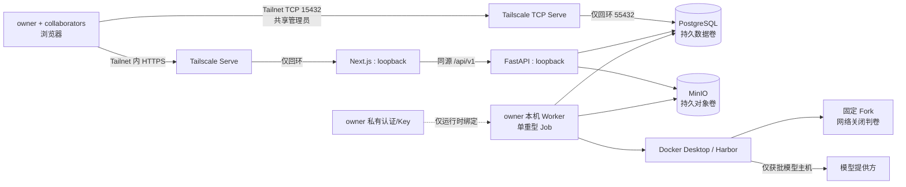

# 所有者单机运行 Module

> 状态：**2026-09-18 最小本地持久化 P1–P4 已完成；同日按用户最新课设决定新增 tailnet 内 PostgreSQL 管理员入口，owner 主机端口自测通过，组员 DBeaver 登录和未授权设备负向仍待验证。备份与恢复不属于课设范围。** 持久化证据见[实施行动](../../../actions/2026-09-17-minimal-local-persistence.md)，数据库直连变更见[组员连接行动](../../../actions/2026-09-18-team-database-connection-guide.md)。
> 目标：让一个 owner 管理的单台电脑安全承载一个五人小组的私有协作入口、数据和真实执行。
> 权威范围：进程/容器放置、信任边界、持久化门禁及已接受的数据丢失风险；产品字段和业务流程仍由其他专题文档维护。

## 1. 结论先行

这种模式可行，适合当前“单机、低并发、owner 审批后才真实运行”的范围。组员使用浏览器、Tailscale、应用账号，并可按[组员 PostgreSQL 教程](../../../operations/TEAM_POSTGRESQL_CONNECTION.md)用 DBeaver 共用 `agentexam_admin`；PostgreSQL 数据本体、MinIO、Docker/Harbor、Worker、固定框架及模型凭据仍留在 owner 电脑。

用户已发布并完成持久化目标 P1–P4；正式单机持久化已有实际证据。2026-09-18 已增加 `sss.tail03c757.ts.net:15432 → 127.0.0.1:55432` 的 tailnet 内 PostgreSQL 转发，主机端口自测成功；五人正式远程使用仍须完成组员 DBeaver 登录、原 M1 任务 14 的未授权设备负向等验收。真实模型 API 试跑仍须另获调用授权。备份与恢复已由用户明确移出课设交付。账号、Job/Run、目录快照及制品将成为团队需要长期保存的状态，但本版不承诺灾难后可找回。阶段依赖在[执行计划](../../../../.scratch/ui-catalog-providers/plan.md)维护；准备度见第 10 节。

正式对象存储采用 **MinIO AIStor Free 修复版**，保留本机/S3 Adapter，不切云。固定镜像已运行，服务端许可脱敏查询为 FREE、非 Trial、单节点、无到期并返回 success；旧 CE 的历史隔离测试证据不作为正式部署基线。镜像身份和来源见[依赖总表第 2.4 节](../../../dependencies/DEPENDENCIES.md#24-最小本地持久化的部署候选2026-09-17)。

### 1.1 已确认的课设运行约束（2026-09-17）

本节维护运行方式与容量取舍，具体磁盘数据只在[本机环境](../../../operations/LOCAL_DOCKER_ENVIRONMENT.md#21-课设容量只读盘点2026-09-17)维护。用户明确这是五人课设、预期数据不多，主要担心本机空间；不能据此宣称实际容量已足够。

| 选择 | 已确认内容 | 仍未落实的部分 |
|---|---|---|
| 启停方式 | 用时手动启动存储，不随开机自动启动；Worker 经另行授权后在 owner 前台运行；不用时由停止命令先停领、等活动 Job 收束再停存储 | 初始化、启动、停止、状态入口及假 Worker 停领已验证；本轮未启动真实 Worker |
| 数据丢失风险 | 本课设不做备份和恢复；只要求 D 盘目录完好时正常停止/启动、容器重建及电脑重启后可读回 | 误删、损坏、数据库逻辑故障或 D 盘故障可能导致全部业务数据丢失，用户已明确接受 |
| 正式业务数据 | 根目录选定 `D:\AgentExamData`，不是旧 `D:\dockerdata`；代码与当前 E 盘 Docker 数据不搬迁 | postgres/minio/control/private 已实际建立并受限；合成业务记录和 9 个对象跨两容器删除/重建及 Windows 重启读回通过 |
| 首版范围 | 本地 PG/MinIO 持久化、必要初始化/升级、手动启停和明确容量预算 | 不增设云服务器、云数据库、备份系统或生产级高可用系统；本机自身 WLAN/Tailscale 等非回环地址负向通过，另一设备检查仍属任务 14 |
| 云存储 | 暂列未来可选，首版使用本地业务存储 | 未选择供应商、开通、付费或上传；当前无需用云端承担备份 |

容量规划必须区分项目源码与依赖、Docker 镜像/卷与运行空间、业务记录/证据。迁移正式存储到云端是另一项架构选择，本轮未采纳。

持久化不是备份：D 盘目录能跨容器重建保留，并不覆盖误删、损坏或整盘故障。用户基于课设规模明确接受这项风险，因此本版不实现备份；文档和界面不得暗示已有恢复保障。

## 2. 候选逻辑拓扑



Next.js HTTPS 和 PostgreSQL TCP `15432` 通过 Tailscale Serve 对获准设备可见；PostgreSQL 的 Docker 宿主发布仍保持回环 `127.0.0.1:55432`。FastAPI、MinIO、Docker API、Worker、模型代理和秘密目录不直接暴露给 tailnet、校园网或公网。Tailnet 负责“设备能否到入口”；Web 应用角色仍负责“用户能在页面做什么”，但五人共用的数据库超级管理员会绕过应用角色，这是用户为课设明确接受的简化边界。

## 3. 五人怎样协作

1. owner 在本机显式初始化 schema、建立 owner 账号、登记可信任务/配置并发出邀请。
2. 其余成员加入指定 tailnet，通过 HTTPS Web 兑换邀请并以 collaborator 登录。平台设计支持一个 owner 加若干 collaborator，不需要为“五个人”新增角色或数据库表。
3. collaborator 通过 Web 选择受控题目/配置、创建 Job、查看结果；开发期间也可按教程直连 PostgreSQL 并共用 `agentexam_admin`。仍不能直连 MinIO bucket、容器或模型端点。
4. owner 在 Web 检查冻结摘要并批准/拒绝。Worker 只领取已批准 Job，且一次只执行一个重型 Job。
5. owner 按第 1.1 节手动开放平台；电脑关机、休眠、断网或 Tailscale 停止时，整个平台不可用。重新在线后按持久证据恢复，不自动续跑中断 Trial。

## 4. 数据与秘密分层

| 位置 | 保存什么 | 持久化要求 |
|---|---|---|
| PostgreSQL | 账号/会话/邀请、任务与配置索引、Job/Run/事件、确定性结果、制品索引与审计 | 专属长期数据卷；显式 schema 升级；本版无备份 |
| MinIO | 原始任务快照、patch、公开/原始轨迹、判卷报告和日志对象 | 专属长期对象卷；按对象摘要复核；本版无备份 |
| owner 私有文件 | Codex 登录、未来 API Key、固定 CLI 归档、受限临时运行证据 | 独立 ACL；秘密不进入 Git、PG 或 MinIO；其个人恢复方式不属于本课设交付 |
| Git 工作区 | 源码、SQL、公开配置模板和文档；忽略的 `infra/.env` 保存 owner 本机配置 | 被 Git 跟踪的文件不保存秘密、正式数据卷或真实运行原始输出；`.env` 不得提交或分享 |

“Docker volume 存在”只解决容器重建后文件是否还在；它不是备份。磁盘故障、误删、损坏和勒索软件仍会同时毁掉容器与本机 volume。

## 5. 推荐落地顺序与门禁

### A. 不受阻的当前工作

文档整理和纯假数据 HTML 原型可以继续，不依赖长期数据库。产品代码开发若继续使用隔离临时 PG/MinIO，也必须明确这些只是测试环境。

### B. 在真实组内使用前完成

1. 只读清点现有测试数据、正式候选数据、磁盘容量和当前 Docker/WSL 状态；禁止把临时验收库直接当生产库。
2. 固定长期 PostgreSQL 与已确认 AIStor Free 的精确版本、许可、数据目录和容量上限；旧 CE 不用于正式部署。
3. 建立专属持久数据卷和最小权限目录；schema 只通过显式 owner 命令初始化/升级。
4. 验证正常停启、容器重建、存储暂不可用后的状态收束与数据保留；中断 Run 记基础设施错误，不自动重跑。用户已选择窗口并手动完成一次整机重启，项目未自启且正式启动后同一样本完整读回；异常场景仍在隔离环境模拟，不破坏真实磁盘。
5. 再完成 Tailscale 双机正/负、VPN 开关、owner 电脑离线、未授权设备和应用越权验收，才允许五人正式使用。

### C. 在真实模型 API 前完成

长期存储和端口隔离完成后，真实 DeepSeek/Kimi 试跑仍须通过已有假提供方/代理安全门禁并取得真实调用授权；Key 继续只由 owner 私有配置提供。假提供方实现可在隔离测试环境准备。完整远程双机验收是组内正式使用的前置，不额外作为本机 API 单题试跑的技术前置。

## 6. 当前进程与候选部署文件树

```text
apps/web/
  next.config.ts                                      # 只把同源 API 转发到 127.0.0.1 FastAPI
  package.json                                        # Web 仅绑定 127.0.0.1 的 dev/start 命令
apps/backend/src/eval_platform/delivery/
  http/app.py                                         # FastAPI Composition Root
  http/config.py                                      # public origin 与专属 PG 连接配置
  worker/runtime.py                                   # owner 本机 Worker Composition Root；固定路径/秘密门禁
  worker/main.py                                      # 单次 claim 执行 shell
  worker/command.py                                   # 内部命令控制：单次/循环、停领、等待、安全错误，不负责生产装配
  owner.py / catalog.py / jobs.py                     # 显式 schema、owner、目录和保留维护入口
apps/backend/src/eval_platform/adapters/
  persistence/bootstrap.py                           # 空库检查与四份 schema 单事务初始化 Facade
  persistence/                                       # 其余 PostgreSQL Repository Adapter 与 SQL
  artifacts/config.py / artifacts/minio.py            # MinIO 私有端点和 ArtifactStore Adapter
docs/operations/
  REMOTE_TEAM_ACCESS.md                               # 已确认的 Tailscale 私有入口和端口规则
  TEAM_POSTGRESQL_CONNECTION.md                       # 五人从零使用共享管理员连接 PostgreSQL 的操作教程
  LOCAL_DOCKER_ENVIRONMENT.md                         # 机器/Docker 动态事实与历史临时拓扑
infra/                                                # 已确认并创建：项目专属部署工具箱
  compose.yaml                                        # 正式本机双存储绑定、回环端口、秘密文件，无自动重启
  .env                                                # Git 忽略的 owner 本机统一配置；由公开模板复制，不提交/分享
  .env.example                                        # 公开配置契约；逐字段说明 Compose、HTTP、MinIO、Worker 与 Web，无真实秘密
  local/
    AgentExam.Local.psm1                              # 固定身份、路径/ACL、Docker/Compose 共享实现
    AgentExam.Initialize.psm1                         # 就绪、schema 和 AIStor 首次初始化内部实现
    AgentExam.Lifecycle.psm1                          # 状态、停止标记、活动 Job 排空及生命周期 Facade
    Initialize-AgentExam.ps1                          # 公开一次性初始化/只读预检入口
    Start-AgentExam.ps1                               # 公开日常启动入口；不初始化、不启动 Worker
    Stop-AgentExam.ps1                                # 公开正常停止入口；不强杀、不删除数据
    Get-AgentExamStatus.ps1                           # 公开无秘密 JSON 状态入口
    minio-app-policy.json                             # 应用身份仅有私有 bucket 三项对象权限
  tests/                                              # 配置、初始化、权限、生命周期和跨重建验收
```

用户已确认 `infra/`：业务 Repository 负责读写，临时验收脚本不适合承载部署生命周期。精确实施树在本次实施行动中持续维护；不新增业务 Module、Interface 或数据库表。

## 7. 现实约束与尚未收敛的技术点

- 当前 Worker 是 owner 主机进程，需要同时访问 PostgreSQL、MinIO、固定本地 framework 和 Docker Desktop。PG/MinIO 的 Docker 宿主发布仍只绑定回环地址；PostgreSQL 另由 Tailscale TCP Serve 把 tailnet 的 `15432` 转发到本机 `127.0.0.1:55432`，MinIO 不开放给组员。
- 既有本机记录指出 Docker Engine `27.5.1` 存在回环发布安全风险，历史临时桥接也不是长期模板。正式上线前必须实测存储端口从 LAN/tailnet 不可达，并复核本机连接认证及数据/秘密目录权限。回环绑定只能限制网络入口，不能证明其他本机进程无法连接；部署时还需核查当时版本与实际隔离行为。
- 把 Worker 放进容器并挂 Docker socket 会给它近似宿主 Docker 控制权，不作为默认捷径。当前推荐先保留 host-run Worker，再解决受验证的本机存储连接。
- owner 电脑的内存历史值、当前磁盘余量和只读目录统计见本机环境第 2 节；新增题目镜像与正式数据前需要按实际目标盘预留增长空间，不能只按账号人数估计容量。
- 手动启停、业务数据根目录和不做备份的风险接受均已落实，见第 1.1 节；不安装开机自启动服务。容量阈值仍是长期观察项，不阻止当前低数据量课设运行。

先前 C 盘候选已被第 1.1 节的用户选择替代，不再作为待决方案。项目代码、runtime 输出、PG/MinIO 数据和共享 Docker 磁盘是不同位置，不能只改业务目录便宣称整体容量问题已解决。若未来需迁移共享 Docker 磁盘，须另列影响其他应用的停机/回退计划并取得对应授权，不由业务目标盘选择自动授权。

## 8. 依赖方向、替代方案与选择理由

候选仍是单机模块化单体：Web/API/Worker 是进程角色，PG/MinIO 是存储 Adapter，不拆微服务、不引入 Kubernetes、Redis/Celery 或云端控制面。这样复用已有 Interface，最少改变业务代码，也符合单机/低并发目标。

未采用的替代方案：

- 让协作者直连 PostgreSQL：用户已为五人课设明确采用共享超级管理员方案；代价是扩大秘密和数据面、绕过应用权限、无法按成员审计且误删不可恢复。MinIO 直连仍不采用。
- 暴露 FastAPI 或 Docker 端口：增加攻击面且没有产品收益，不采用。
- 不做备份：已作为课设范围裁剪采用；代价是误删、损坏或 D 盘故障后可能全部丢失，不得宣称具备恢复能力。
- 立刻迁云或做多机：超出当前一台正式执行节点和项目周期，不采用。
- Worker 容器直接挂 Docker socket：部署看似统一，但宿主控制风险过高，当前不推荐。

## 9. 上线验收清单

- [x] 正式 PG/MinIO 版本、镜像来源和数据目录已冻结；容量按课设低数据量观察。
- [ ] PostgreSQL 仅从 owner 回环和获准 tailnet 的 `15432` 可达：owner 经 Tailscale 地址自测成功；组员 DBeaver 正向和未授权设备负向待验。MinIO 仍只在 owner 本机受信路径可达。
- [x] schema 初始化是显式操作，日常启动不建表；非空未知库拒绝初始化。
- [x] 正常停止/启动和容器重建后，PG 记录、MinIO 对象引用、大小与摘要保持一致。
- [x] 一次 Windows 整机重启已有可检查结果：项目未自动启动，正式启动后 5 类业务记录和 9 个对象全部读回。
- [ ] 异常中断、存储不可用与磁盘阈值仍需按未来实际需求分别验收，不由正常重启结果代替。
- [ ] Tailscale 只暴露 Web HTTPS 与 PostgreSQL `15432`；组员数据库正向、未授权设备负向、应用越权、VPN 开关和离线场景仍待补齐。
- [x] 存储秘密不在 Git、镜像、argv、共享 env 或页面中，宿主源文件为 owner-only；本机 `.env` 被 Git 忽略且不得分享，模型凭据只记录路径、不复制正文。
- [x] Worker 命令仍是单重型 Job、一次尝试、零自动重试；假 Worker 已验证停止后不领下一项，本轮未启动真实 Worker。
- [x] owner 有可执行的初始化、启动、停止、状态和故障说明，且明确告知无备份风险；撤权仍由既有业务入口负责。

详细阶段范围见[持久化规格](../../../../.scratch/persistence-deferred/spec.md)，交付顺序和成功标准由[行动指南](ACTION_GUIDE.md)维护。正式 D 盘挂载、初始化、AIStor Free 许可、跨容器重建、Windows 整机重启和本机非回环端口负向均已有实际证据；另一设备入口负向与整个 MVP 仍未完成。

## 10. 当前代码准备度（2026-09-18 实际核对）

**结论：课设最小本地持久化的业务读写、显式初始化、手动生命周期、跨容器重建和一次 Windows 整机重启后的保留已经具备实际证据；PostgreSQL tailnet 管理入口的 owner 端口自测也已通过。** 尚未覆盖灾难恢复、版本化 schema 迁移、真实 Worker/模型运行、组员 DBeaver 登录和未授权设备负向；这些限制不能由主机自测或合成验收替代。

| 能力 | 当前源码证据 | 准备度及剩余工作 |
|---|---|---|
| PostgreSQL 业务存取 | [persistence](../../../../apps/backend/src/eval_platform/adapters/persistence/) 包含身份、邀请、目录、Job/Run、事件、结果、制品索引 Repository 与事务 | 已有；无需重写业务存储层 |
| MinIO 对象存取 | [minio.py](../../../../apps/backend/src/eval_platform/adapters/artifacts/minio.py) 的不可变写入、摘要回读、限长读取和受控删除 | `agentexam-private` 与 `agentexam-app` 已建立；对象写/摘要读/删通过，匿名读取及列桶/对象均 403 |
| 应用装配 | [HTTP app](../../../../apps/backend/src/eval_platform/delivery/http/app.py)、[Worker runtime](../../../../apps/backend/src/eval_platform/delivery/worker/runtime.py) 已连接正式 Adapter | 已有；连接信息来自显式环境配置，正式 D 盘存储已由独立部署配置完成并验收 |
| 首次建表 | [bootstrap.py](../../../../apps/backend/src/eval_platform/adapters/persistence/bootstrap.py) 由 [owner.py](../../../../apps/backend/src/eval_platform/delivery/owner.py) 的既有 `init-db` 调用，在空库检查后以单事务执行四份现有 SQL | 正式 D 盘 PostgreSQL 已建立 11 表；重复初始化只核对完成状态、不清库，非空拒绝已在专属测试库验证；AIStor 初始化同入口配套脚本已完成 |
| 保留既有数据的 schema 升级 | [Job SQL](../../../../apps/backend/src/eval_platform/adapters/persistence/jobs/schema.sql) 主要为 `CREATE TABLE` / `CREATE INDEX`，初始化入口直接执行整份 SQL；仅有特定成员表升级入口 | 尚无完整版本化升级、旧库校验和回退流程；不能对长期库重复执行 init-db 充当迁移 |
| 中断 Job 收束与到期清理 | [recovery.py](../../../../apps/backend/src/eval_platform/application/job_lifecycle/recovery.py)、[retention.py](../../../../apps/backend/src/eval_platform/application/job_lifecycle/retention.py) | 已有 owner 显式入口；恢复 Job 状态不等于从备份恢复数据库或对象 |
| 长期数据卷与启动配置 | [compose.yaml](../../../../infra/compose.yaml)、[.env.example](../../../../infra/.env.example) 与 [local](../../../../infra/local/) 提供统一本机变量、固定镜像、D 盘 bind mount、显式初始化及日常启停/状态 | Compose 生命周期读取 Git 忽略的 `infra/.env`；两服务既有持久化证据保持有效。HTTP/Web/Worker 仍通过既有进程环境接口读取同名变量，不新增第二套配置解析器 |
| Worker 持续处理 | [main.py](../../../../apps/backend/src/eval_platform/delivery/worker/main.py) 保留 `run_once`；runtime 委托 [command.py](../../../../apps/backend/src/eval_platform/delivery/worker/command.py)，默认单次、显式 loop/stop-file | 假 Worker 命令测试覆盖顺序领取、空闲等待、停领和失败零重试；停止脚本写标记并等待主库活动 Job 归零。本轮未启动真实 Worker，不把它描述为真实模型验收 |
| 备份与恢复 | 在项目自有源码、部署候选路径和维护入口中未找到正式 PG+MinIO 备份/恢复实现 | 用户已明确移出课设交付；不是待实现项，也不得描述为已有能力 |

任务 13 的专属临时环境仍是历史证据；当前长期 D 盘卷的停止/启动、跨容器重建及 Windows 整机重启证据由[本次实施行动](../../../actions/2026-09-17-minimal-local-persistence.md)维护。另一设备端口负向仍由原 M1 任务 14 管理；备份恢复已不在当前范围。

最小后续工作集中在部署配置、维护脚本和现有入口的少量补齐，不需要先更换 PG/MinIO Repository 或新增业务表。由于后续题库规模/提供方扩展会改变现有 SQL 约束，长期库建立前应定义 schema 基线，后续修改必须提供保留旧记录的升级路径；在没有备份的当前范围下，任何真实 schema 迁移都必须另行说明不可逆风险。
